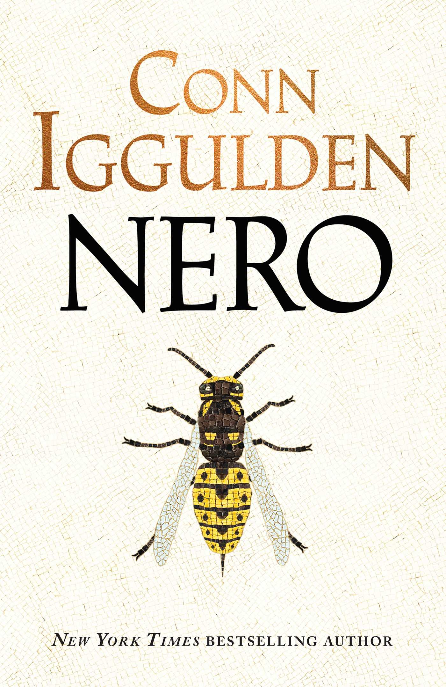
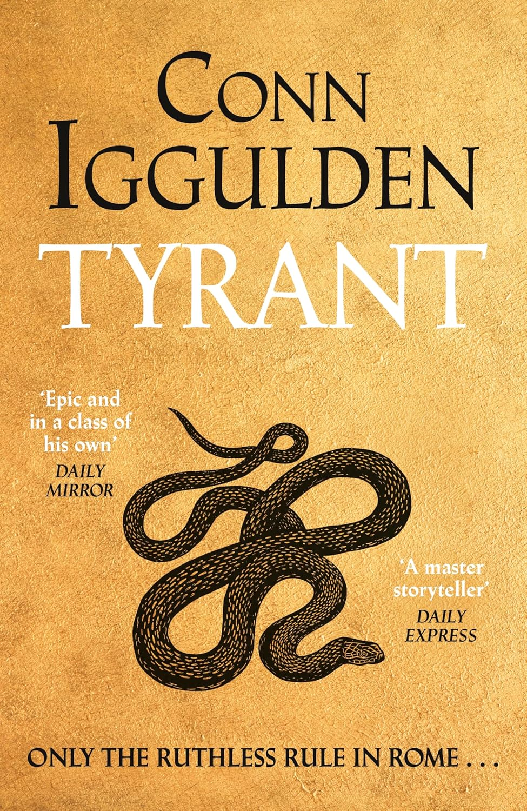

<section>

It's approaching the end of the year, and that means it's time for my annual reading list. I'm happy to report that this year - especially in the first half, I've read a lot more than in the previous one. While great news, it does mean that there's much more to write about, so this time I'm going to split the list into an English and a (considerably longer) Spanish part, which you'll be able to change between using the language switcher in the top right, once it's published. As before, I'm planning to go chronologically, writing a short background on each book, and giving out some "highly recommended" awards.
</section>

<section>

## Oedipus Rex - Sophocles, Johnson (2005) translation

While I was on my year abroad studying in Spain, I restricted myself to only reading books in Spanish (hence why the English part of this list is relatively short), with the exception of *Oedipus Rex*. I read this as part of a course I was taking, [*Cultura Clásica*](https://www.uah.es/es/estudios/estudios-oficiales/grados/asignatura/Cultura-Clasica-252012/) (Classical Cultures), for both the coursework and the exam. Being the first Ancient Greek/Roman literature I looked at, I read it in English to better (and quicker) understand it. [The translation I used](http://johnstoniatexts.x10host.com/sophocles/oedipusthekinghtml.html) is a modern text, which made it much easier to parse and more enjoyable, and also came with very helpful footnotes explaining context, characters, meanings, and more.

Sophocles is one of the most celebrated of the Ancient Greek tragedians, alongside Aeschylus ("the father of tragedy") and Euripidies ("the most tragic of poets"), and *Oedipus Rex* is likely his most famous work. I enjoyed it a lot, it was interesting reading something in such a different format to what I'm used to, and it tied into learning about the culture and [geography](https://formularsumo.github.io/Mapa-Interactivo-Grecia-Antigua/) of Classical Greece as part of the course. Interestingly, I didn't feel as strong a sense of wanting to stop what was happening, of things going wrong, as in other fated tragedies - I felt that the characters here were often harder to sympathise with. Overall though I still liked the story and the setting, and at some point I plan to read Sophocles' *Oedipus at Colonus* and *Antigone*, whose events take place shortly afterwards (while not strictly being sequels).
</section>

<section>

## Autocracy, Inc. - Anne Applebaum

This was, without a doubt, the best book I read this year. As often happens, I found myself browsing the shelves (and tables, in this case) at Waterstones, and came across this intriguing title. After a good half an hour or so or reading in the shop, I bought it, and read it over the course of a few days - the first book I read after coming back to the UK, and Exeter. The book is an extended version of recent pieces by Applebaum, and both the depth and breadth of her reporting is excellent. It ties together the key parts of modern autocracies - including money and co-operation, information narratives and social media, and their global, transnational effects, into one accessible, factual, and compelling book which I can recommend to everyone.

I found it so useful that I re-read it shortly after to [make notes](https://docs.google.com/document/d/1B1GY_iqLGkn68hw-A_xCCMzfNM952JmoesOehuFk5ZQ/edit?usp=sharing), and it's inspired various projects and [investigation](https://docs.google.com/spreadsheets/d/1DmMoxKW1YjrbhlKqiiFIscKbBvLL5X0Ff3y70EzyvPc/edit?usp=sharing) since then. Perhaps most importantly, it comes with a wide variety of ideas for protecting the free world and for reversing the current trends of autocratization. So if you're stuck wondering why the world is how it is at the moment, and how we can go about trying to improve it, then there's a good chance that this is the book for you.

</section>

<section>

## Nero - Conn Iggulden

11 June 2016 is when I took out my first Conn Iggulden book from the library: *Lords of the bow*, the second of his Genghis Khan and descendents series. Shortly after coming home with it, my mum had a look through and decided it was not appropriate for me - then an 11 year old, and off it went back to the library. So, on my next trip to the library with my dad, 11 year old me tried again - this time with the first book in this series, *Wolf of the plains*, making sure to hide it at the bottom of a large pile of books I took out alongside it, and later under my bed. And so began my introduction to the world of historical fiction.

Since then I've loved Iggulden's books, having read most of them (the fictional ones too), and I think it'd be fair to say that historical fiction is my favourite genre - combining historical events and settings with amazing storytelling and prose is simply an incredible combination. This - the opener of the Emperor Nero triology - was the first one I'd read in over 2 years, and it was almost addictive coming back to it; I finished this book in the space of a few days while on holiday. I'd say it was also one of the best I've read, I think the story felt more unique and the characters/relationships had more complexity than previous ones, although that may just be because my memory of them has faded with time. Regardless, it was the book I enjoyed most this year, and is a great way to get into the genre... if you don't mind the oddities and at times uncomfortableness of the Roman elite...

</section>

<section>

## Tyrant - Conn Iggulden

</section>

<section>

## A Clockwork Orange - Anthony Burgess

</section>