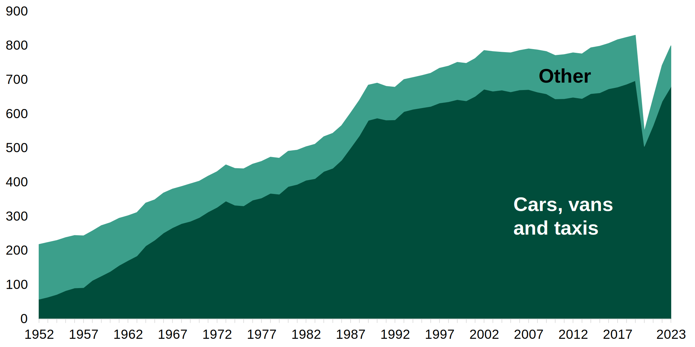
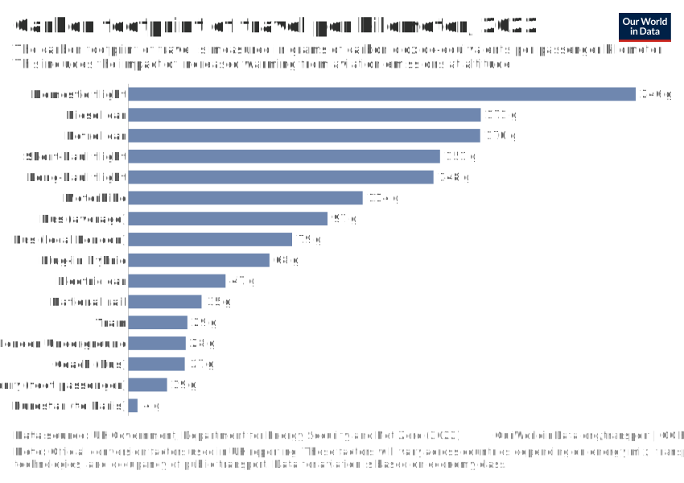
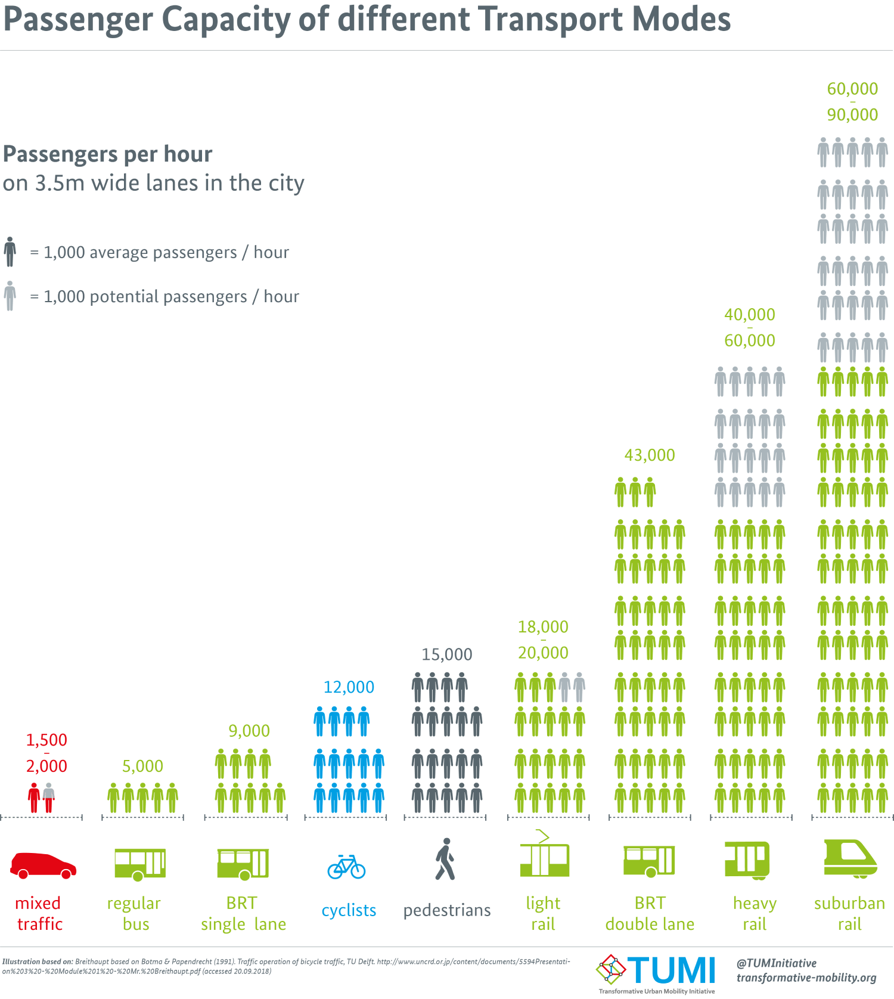
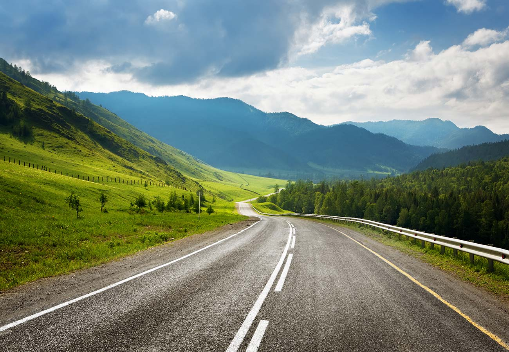
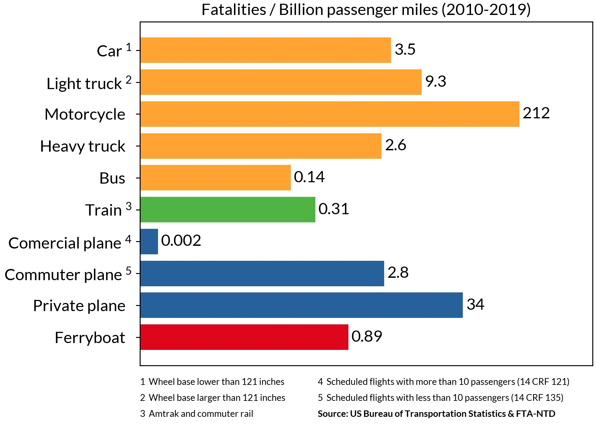
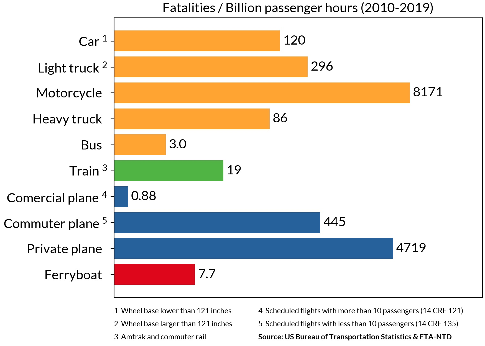
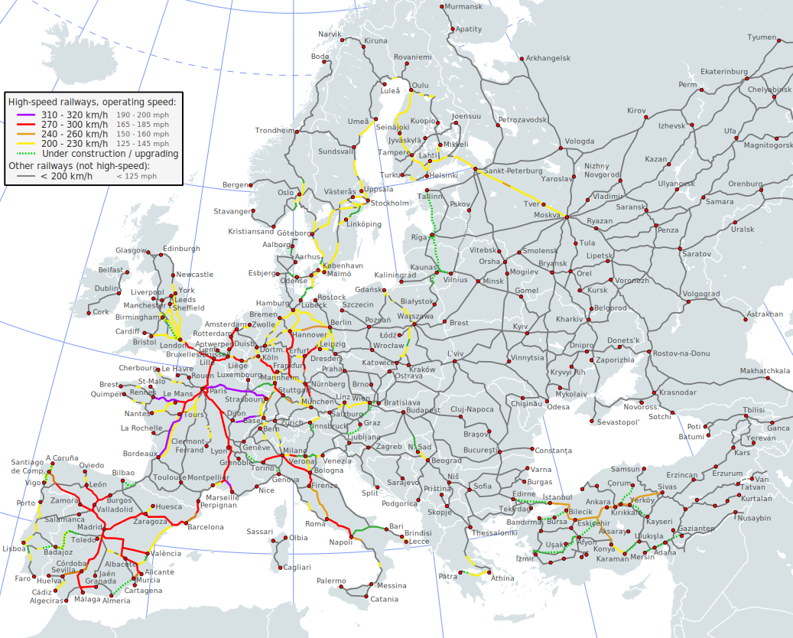
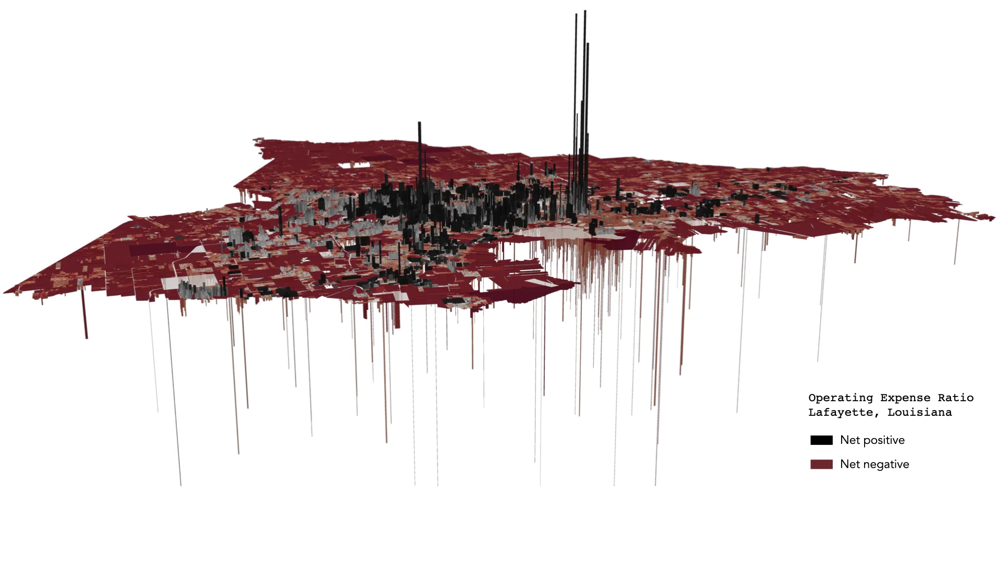
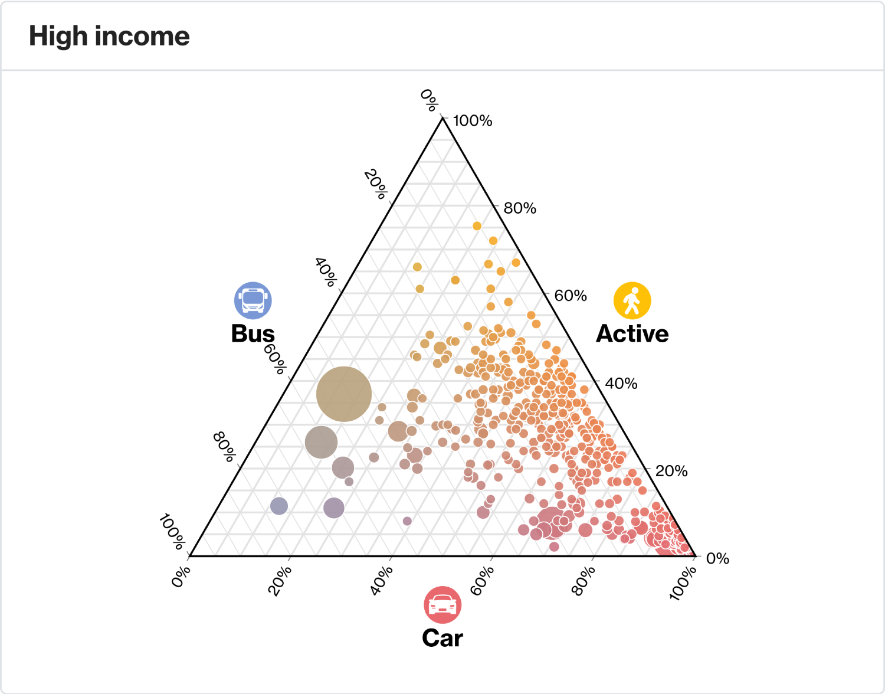

## The lay of the land

According to the [latest government statics](https://www.gov.uk/government/statistics/transport-statistics-great-britain-2024/transport-statistics-great-britain-2023-domestic-travel#:~:text=TSGB0101%20and%20TSGB0102.-,Of%20the,-799%20billion%20passenger), 90% of the distance travelled in Great Britain takes place by road: 85% by private vehicles, 4% by bus and coach, and 1% by motorbikes and pedal bikes, while the remaining tenth is made up by rail (9%) and air (1%). This is a marked change from just a century ago, and this rise in car-centric transport and lifestyle has drastically changed our movement patterns and, as I'm going to argue, has largely done so for the worse.

Passenger transport by car, vans and taxis compared to other modes, billion passenger kilometres per year, Great Britain, 1952 to 2023

## Accessibility: Transport for *everyone*

Driving and owning a motor vehicle is a big responsibility. Learning to drive is a time-consuming and expensive process, and something which is not an option for a lot of people. The young, the very old, the disabled, and many more are largely or not at all able to. Buying and maintaining a car is expensive: purchase, fuel, maintenance and MOTs, repairs, insurance, parking and road taxes nowadays combine to form British people's second largest expense after housing<a id="n-1" href="#fn-1">1</a>

<!-- annoyingly the embed doesn't want to resize, so this is the largest I can make it without it having a lot of blank space on phone screen -->

<a href="https://www.ons.gov.uk/peoplepopulationandcommunity/personalandhouseholdfinances/expenditure/bulletins/familyspendingintheuk/april2022tomarch2023"><iframe height="515px" width="100%" style="border:none;" src="https://www.ons.gov.uk/visualisations/dvc3011/treemap/index.html"></iframe></a>
Average weekly household expenditure in the UK, financial year ending (FYE) 2023, Office for National Statistics

I've titled this article "transport should for the public" because I strongly believe that everyone has the right to get around and to where they need to, independently and without reliance on their ability and economic provisions to drive, or on a family member or friend to do so for them. I grew up in quite a car dependent place, and I was very reliant on my parents to take me around; if they weren't available or willing to, I often couldn't (easily, quickly or cheaply) get to where I wanted to.

Throughout most of our human history, we've walked everywhere. Or perhaps ridden a horse, maybe with a carriage or cart. Sometimes even a boat if we were feeling adventurous. And these are still very good ways of getting around (bicycles now included as well), but in our modern societies we go much further distances, much more often. While active transport should remain our first option for shorter trips (for those who are able to), we need engine-powered vehicles to go further. And for transport to be truly accessible and universal we need solutions which are available to everyone, low-cost, quick and convenient.

## Cars: Unsustainable in more ways than one

I've laid out the moral case for public transport - for why it's needed, but it absolutely should not just be the last option, for those who don't have others. It should be, with few exceptions, the first.

### Pollution

It's common knowledge that combustion engine cars are one of the most polluting forms of transport (and the transport sector itself is the [second most polluting](https://ourworldindata.org/emissions-by-sector)), heavily impacting global warming and the climate emergency, local levels of air pollution, and noise<a id="n-2" href="#fn-2">2</a> pollution. And according to the latest UK Gov statistics, their greenhouse emissions per kilometre are second only to domestic flights, an option so unsustainable that countries such as France are taking steps to ban them<a id="n-3" href="#fn-3">3</a>.

Carbon equivalent per kilometre of different modes of transport

It's true that hybrids and electric cars are a lot better, but they're still not great options. The vast vast majority of cars on the road have combustion-engines and will do for quite a long time. Even at the time of writing new EVs make up only [20% of new vehicle registrations, and 4% of cars on the road](https://www.zap-map.com/ev-stats/ev-market). But if you look closely at the chart you'll notice that electric cars are actually not all that sustainable. How can that be? In part because a lot of our electricity production still comes from fossil fuels. But that's not the full picture, because options such as long-distance coaches which *do* mostly use fossil fuels are still less polluting, and local buses are significantly better than petrol/diesel cars. The reason for this is that cars typically use a lot, lot more energy per person. The average UK car trip has [1.6 people onboard](https://assets.publishing.service.gov.uk/media/66ce0f6f25c035a11941f655/nts0905.ods) and a  maximum of 5, but an average bus trip has [11.9](https://assets.publishing.service.gov.uk/media/6745b86683f3d6d843be96c9/bus03.ods) and a maximum of 60-100<a id="n-4" href="#fn-4">4</a>, while only using 4-6x as much power.<a id="n-5" href="#fn-5">5</a>. If you do the maths this means that an average bus carries around 7.5x as many people, while using roughly 5x as much energy - an improvement of 1.5x. But if you take a reasonably full bus, say 80% capacity (64) vs the same for a car (4), you get 16x as many people - an improvement of just over 3x. With a car, you have a lot of car body for very few people, whereas a bus has a much higher ratio of people to vehicle, and will also typically get far more use before having to be replaced while producing less pollution overall from [tyre wear](https://www.theguardian.com/environment/2022/jun/03/car-tyres-produce-more-particle-pollution-than-exhausts-tests-show#:~:text=represent%20only%2011%25%20of%20the%20particles%20by%20weight%2E).

To really get the point across, national rail - which unlike long-distance coaches typically does have quite a lot of stops - still produces less emissions per km than EVs and the [majority of it](https://railmap.azurewebsites.net/Public/ElectrificationMap)<a id="n-6" href="#fn-6">6</a> is *not yet electrified*. The very high efficiency of train carriages (person to vehicle body ratio) combined with the low-friction of rail and with mostly smooth journeys (no sudden braking and acceleration, traffic or idling) makes them unbelievably efficient in terms of energy usage. The Eurostar - a fully electrified and modern train line (which bypasses the inefficiencies of an EV battery) - produces an order of magnitude less emissions than electric cars.

### Carrying capacity & infrastructure

While most people are familiar with the high levels of pollution caused by cars, their impact on space usage and subsequent effects on city designs is often less well understood. I've already alluded to their poor carrying capacity but to put things into perspective it's helpful to see a visualisation.

Passengers per hour on a 3.5 metre wide lane in the city for different modes of transport

Of all the common forms of transport, cars are the least efficient way of moving people. Using the same amount of space they carry 6-7.5x less people than cycling or walking and over 20x less than having dedicated bus lanes. Vs heavy rail and metros systems the comparison is even more stark with differences of 30-45x, notwithstanding that metros are often largely located underground anyway.

So where does this matter? Most obviously it matters in urban centres with high density housing and lots of people (commuters, tourists) moving in and out. Trying to transport hundreds of thousands or even millions of people by car in these locations would simply be impossible. As well as being less efficient to begin with, trying to increase car carrying capacity tends to scale significantly worse than shared transport. City planners are well versed in the concept of induced demand, where widening or building more roads generally leads to more people using the road and no improvements to traffic (or even worsening). With enough roads you *might* be able to overcome this problem, but the space and costs needed would be astronomical, as would the complexity of the system - and human drivers are not very good at using extra road space and distributing themselves evenly across it. Public transport meanwhile is comparatively easy to scale as needed to meet the demands of even the most populated places on Earth.

### Car-first design & dependency

The effects of car-centric transport don't just affect urban centres, and they arguably have a greater impact on the rest of the population. Over the past hundred or so years many new places - mid and small-sized towns - have been built to be car-first. While older settlements have been retrofitted to adapt, and metropolises simply can't support it, these places - above all in North America and the countries with the most influence from there - are designed around cars. The end result of this is as inevitable as it is self-fulfilling.

Pre-car towns and villages are designed around and for humans. Lots of amenities, attractions and places of work are located within a short walking of each other. Everything is built at a human scale - you can walk along the street and feel like you belong there, passing easily from building to building. When you needed to go between one walkable zone and another you'd take a form of collective transport such as a [tram/streetcar](https://en.wikipedia.org/wiki/Tram#History) or a horse and carriage. In complete contrast, places built around cars are often entirely unfriendly to humans. Buildings are spaced much further apart, and often separated by busy roads and gigantic car parks.

Historically when designing and building a place, there's always been a clear distinction between roads and streets. *Roads* are designed for transporting people: for going between different zones within a city and between different cities or towns. They can be general-purpose roads intended for all sorts of vehicles such as horse-drawn ones, electric trolley cars, cycles and pedestrians, and of course cars, or dedicated train lines designed for heavy rail. As seen, rail tends to be more efficient, and faster, but less flexible. Both are important to have. But once you enter a town or a zone, you'd find mostly streets. *Streets* are designed for humans. They are typically smaller, and filled with all sorts of shops, attractions, parks, public spaces and facilities. While roads are usually fairly empty, save for an occasional service station, streets are the places where people live and spend time. Forums and plazas, markets, street musicians and performers, libraries and places of study, civil buildings, works of architecture and art: streets are what make a place.

Left: a road in the US. Right: a street in Amsterdam

The problem with car-first designs is that they blur these lines. They design streets at the scale of a road, where everything is too far apart and very unfriendly, and usually dangerous, for humans. These street-road hybrids are often called *stroads*.

A stroad in the US

While it would theoretically be possible to walk to and around the above retail parks, they're clearly not designed for it. It would be incredibly dangerous to do so with the narrow or nonexistent pavements, placed near to and virtually without protection from the congested and chaotic lanes of traffic. Just imagine trying to cross them. To make a street an enjoyable place to be it both needs to be and feel safe, and to be inviting to its users: visually interesting and varied. This place and most like it are entirely barren, save for a sparse few repeating trees. I have walked around many of these and it's an awful experience. It feels like you're completely out of place and that at any moment a car might appear out of nowhere and hit you (especially when there simply aren't pavements connecting certain parts, and so you have to walk on the roads), not to mention the noise and fumes. But when somewhere is designed for and at the scale of cars this is the result; anybody who's not inside a car is an outsider and the vicious cycle of car-design and car-dependency continues. And children who grow up in places depending on parents to drive them everywhere will learn that driving is the only way to get anyway here - and that they'll need to learn and buy a car to acheive any degree of independence and mobility.

### Car-centric lifestyles & parking

According to [research by the British Parking association](https://www.britishparking.co.uk/write/documents/library/reports%20and%20research/bpa_uk_parking_sector_report_awweb.pdf), there were estimated to be over 45 million parking spaces in 2013 (including private parking) - not far off 1 space per person. And [according to the RAC foundation](https://www.racfoundation.org/assets/rac_foundation/content/downloadables/facts_on_parking.pdf) the average car spends 96% of its time parked, and just 4% in use. These statistics helpfully highlight the final but equally important problem with car-centric design. We've looked at how car-first designs are very inefficient at moving people around, and so take up a lot of road (or stroad) space. We've talked about how they cause buildings to become oversized and placed very far apart, while making them highly unappealing to anyone not inside of a car. But the cherry on top is that in addition to all this, cars take up space when not in use - a lot of it. If you look at a top-down view of a retail park such as the above ones, or of a typical US suburb, you'll notice that most of the space that's not road is actually used for car parking. Car parks take up vast quantities of space and often take this space away from streets and other human-scale buildings. A welcoming, enticing street or public space is broken by a large surface car park, and providing (or even mandating) multiple parking spaces per home is a sure-fire way to guarantee car-scale designs instead of human-scale ones.

It doesn't really need stating, but shared forms of transport use far less parking space. For one because there's a lot less needed due to their efficiency in moving people around, but more acutely because when you get off a bus or train, or taxi, the vehicle continues on its way to serve other people, rarely stopping during the day. When stored at night they're typically parked out of the way in a station or depot. The difference with private vehicles could hardly be greater. As a real-world example which I came across recently, more people arrive at and depart from Gatwick airport by train than by car. But while the train station occupies next to no space, and passengers arrive practically already inside the airport, the car parks require far more, and have long walks or follow-up trips to then arrive at the terminals.

London Gatwick Airport: red = airport parking, blue = airport train line

The above RAC foundation report states that there were over 27 million private cars in 2012, close to one for every other person, and the [Department for Transport estimates](https://www.gov.uk/government/statistics/national-travel-survey-2022/national-travel-survey-2022-household-car-availability-and-trends-in-car-trips) that 78% of households have at least one car, with 34% having two or more. With so many people owning cars, driving them around and parking them, it becomes inevitable that many places end up being designed for cars and incorporating large car parks, large stroads, and human-unfriendly designs.

Number of cars per household, UK, 1971-2022

### Safety

The final way in which cars can be considered unsustainable is in relation to safety. While we have let ourselves get accustomed to it, cars are dangerous. The US National Safety Council states that [1 in 7 preventable injury-related deaths comes from transport](https://injuryfacts.nsc.org/home-and-community/safety-topics/deaths-by-transportation-mode/), and the vast majority of these from car related incidents.

Fatality rates per distance travelled of different modes of transport, US, 2010-2019

Looking at data from the US Bureau of Transportation Statics<a id="n-7" href="#fn-7">7</a> we can see that motorcycles, trucks and cars have the highest rate of occupant fatalities (private jets notwithstanding). But the true picture is worse than it looks because a significant number of the fatalities caused by these vehicles are not the vehicle occupants or even other vehicles, but rather pedestrians and cyclists. In fact, walking and cycling are [statistically some of the least safe forms of transport](https://www.gov.uk/government/statistics/reported-road-casualties-great-britain-road-user-risk-2022/reported-road-casualties-great-britain-road-user-risk-2022-data), despite causing next to zero incidents themselves.

Fatality rates per time travelled of different modes of transport, US, 2010-2019

Averaging by time instead of distance presents a similar picture, with trains and planes doing a bit worse due to generally going longer distances in less time, while buses and ferries improve.

It shouldn't really come as a surprise that private motor vehicles are so deadly given what they are: large, heavy chunks of metal going at high speeds in any direction that the drivers end up taking them, often in spaces shared with or very close to pedestrians, cyclists, and other transport. Unlike train or plane journeys, road vehicles don't follow fixed routes and schedules in order to avoid contact with all other vehicles and people. Road vehicles are able to go anywhere, often weaving in and out of and overtaking each other, with drivers following new routes while doing their best to avoid all the other road users and obstacles. On top of this, human drivers<a id="n-8" href="#fn-8">8</a> are usually bad drivers. They get tired, annoyed, stressed, distracted (eg using their phones), drunk or sleep deprived, and sometimes even put some distorted sense of ego, pride or showing-off before the safety of others, as well as speeding and driving less carefully when they're running late for something. Professional, public-vehicle drivers such as those found in buses and trains are at least being employed to follow the rules of the road and to take their jobs seriously: treating their passengers and other vehicles with respect and safety.

While we do seem to have got used to it, we should expect better from our transport systems. It's hardly an uncommon sight to see a crashed car on the motorway or on smaller roads, and I have people in my family who've suffered debilitating injuries or even death from these accidents. If none of the previous arguments have resonated with you this should: the number of people we're killing and seriously injuring with our car-centric lifestyles is unacceptable, and needs to be drastically reduced. A shift away from such high car usage - especially in our streets and other pedestrian-heavy areas, is a must in order to achieve this.

## Public transport: systems and advantages

Before talking about the different ways of running public transport, I'd like to quickly take a look at some of the positives of travelling on it. So far I've been focused on the many drawbacks of car-first systems, but there's also a few ways aside from these in which shared transport can really shine.

I've talked about how driving a car is a large responsibility - and a dangerous one, and given the statistic of an average of 1.6 vehicle occupants, if you're in a car you're most likely driving it. But driving is a stressful and involved activity. It's true that after doing it a lot the mental load lightens a bit (although it's also the case that experienced drivers typically have some of the worst driving habits), but it's never something natural or easy like walking is. It's really quite bizarre that we've created a world in which a significant chunk of the population spend a lot of time doing it, and not as a job or a hobby. On public transport you don't need to worry about this. Instead of having one driver per every 1.6 people, you have one per every ten, thirty, or even hundreds, meaning that most people instead of focusing on driving can spend their time doing something else. I'm actually writing at this very moment from a train, and so far the entirety of this article has been written while on some form of transport. I also like to read, listen to podcasts or watch things, reply to messages and talk to friends, or just simply relax. All things which you can't (at least not easily and safely) do while driving. And statistics show that travelling for leisure is the [most common reason](https://www.gov.uk/government/news/leisure-travel-tops-charts-for-reasons-people-choose-rail#:~:text=The%20report%20found%20that%3A) for travelling by train in the UK, being roughly twice as common as the [average for travelling](https://www.gov.uk/government/statistics/transport-statistics-great-britain-2023/transport-statistics-great-britain-2022-domestic-travel#why-we-travel:~:text=Why%20we%20travel%3A%20Purpose%20of%20travel).

I've just said that driving is not a very natural activity, but I think this can be said for the whole experience of being in a car. Humans have evolved to travel under their own steam, as human beings, not to go around everywhere hunched up inside a small metal box. Obviously we can't go everywhere by foot or pedal due to the long distances involved, but I think public transport is the closest to this ancestral past. When travelling on transport you normally have to, or at least have the option to, walk a bit. Walk to the station or stop, walk to get on and off and change transport, and to the final destination(s). I'm aware that not everyone is able to or always wanting to do this, and I'll talk more about that in the next section, but I think for a lot of people a lot of the time this is actually quite a good thing. Spending a bit of time each day being active and building this activity into our routine is really good for us. It's a much healthier and more natural way of being than going from point A to B without moving at all and being nearly isolated from the world - instead we take part in it, in our communities, and alongside our fellow human beings.

It's also worth pointing out that living car-free - not owning or leasing a car - means that you don't have to worry about the vehicles you travel in. If you own a car, that car is your responsibility: your responsibility to keep it in good working condition and to get it repaired and MOT'd when necessary, to insure it and to pay for any damage you cause (or prove that it wasn't your fault), to pay for tolls, congestion or emissions charges, to find places to park and to refuel or charge. And if the car breaks down, ends up in an accident, or is stolen, it's not easy, cheap or quick to get a back-up or replacement option. Renting can be just as problematic as often the renting companies put strict requirements on what you can do with the vehicle<a id="n-9" href="#fn-9">9</a>, while expecting the car to be returned in a similar condition as to how you received it, ready for the next customer.

The final point I'd like to raise is that of going somewhere with other people. By car you might be able to go and pick everybody up, and then take them somewhere, and then drop them off again, but this is highly dependent on how far apart you live and how many people there are. While most cars will fit up to 4 or 5 people, more or less any other form of shared transport has a much larger capacity. This can make it a lot easier to go places together, as you simply get on at your nearest station or stop, and more often than not you can arrange with everyone to catch the same train or bus and then meet each other on it. If someone's running late that's okay, they can get the next one and catch you up later, and the same is true if they want to leave earlier or later. It's more flexible for each individual person, and yet an easy option for larger groups. This works especially well if ticketing systems are easy to use, ideally being cheap and with unlimited travel like in the Community of Madrid, or entirely free like in Luxemburg. More on this in the pricing section of the article.

### Buses vs trains

Surely the most iconic form of public transport is the bus. And buses do have some quite important features. Unlike many heavier forms of transport, they're very flexible and easy to run. To set-up up a bus route you just need to get a bus running, and place some bus stops (they can be as simple as a sign). This means they're able to go almost anywhere, and are able to quickly accommodate new developments and destinations into their routes. Buses are also typically very easy to get on and off as, at least with local ones, it's usually as simple as getting on<a id="n-10" href="#fn-10">10</a>, without any need to pass through a station and find a platform. This, alongside the fact that they usually have a lot of fairly close-together stops given they can quickly brake and accelerate, makes them generally better-suited to less mobile folk who aren't able to walk so far.

That being said, buses - especially local ones - also have some quite serious drawbacks which makes them not suitable for some use cases, and which probably goes part of the way to explaining their falling ridership over the past few decades. Most buses go on regular roads with mixed traffic. As seen, this makes them very easy to run, but causes some significant issues. When run like this bus routes have a much lower capacity, typically move people at a slower speed, and are often less reliable than other options - especially in comparison to rail. While we've said that most buses have a maximum capacity of 60-100, the average train carriage is closer to 200 (likewise including standing) - and a train typically comes with quite a lot of carriages attached. Trains are also much more efficient at getting people on and off than most buses, as each carriage will usually have 2-3 different doors that all open at the same time onto a long platform, meaning hundreds of people can get on and off in the space of a few seconds. And while buses and coaches are usually limited to around 100 km/h (60 mph) or less for reasons of safety (again, lots of large heavy chunks of metal going quickly and freely in any direction), typical UK train can reach up to 200 km/h, and in much of [the rest of Europe, Japan and China](https://en.wikipedia.org/wiki/High-speed_rail#Maximum_speed_in_service) this figure is more like 300-350, with the fastest commercial service in operation (Shanghai Maglev) reaching 431 - around half the cruising speed of a commercial plane.

Map of high-speed rail in Europe

As well as being inherently slower due to their size and their more frequent stopping, buses on regular roads are all too often overrun by cars. It's a classic collective action problem: if everyone (or a significant number of people) were to take the bus, everyone would get to their destination faster, but if just one individual person decides to take a private vehicle, they're going to arrive faster. So more and more people do that, far more vehicles get on the road, and traffic slows everyone down a lot. UK buses have quite a reputation for arriving late, or not at all, and traffic is more often than not the main culprit. As well as that, they're often (especially in more rural places) viewed as only for the young, old, and others who are unable to drive - or unable to afford to. As such it's crucial that we design systems which encourage the use of public transport in order to benefit us all, which I'll expand more on later.

#### Distances

Having looked at some of the usual characteristics of buses and trains, we can begin to try and assign them to different use cases.

##### Mid-to-long-distance

I think it's pretty clear that trains are the best option for mid-to-long-distance travel (ie, up to a distance of perhaps 1000-1500 km with current technology - such as Amsterdam to Barcelona, or Bucharest to Athens). They're capable of reaching speeds unattainable by any other form of land-transport, whilst remaining very safe and very efficient. They also tend to be more comfortable for travelling in than road vehicles, having more space (tables, toilets, lots of luggage storage, sometimes even a bar with food and drink), and smoother journeys (gradual speed changes, gentle turns and inclines, and good "roads"), although this can vary a bit depending on the place. These kinds of trains are designed to go at high speeds, and as such shouldn't have many (if any) stops along their routes. They also shouldn't have complicated or long boarding procedures or baggage policies if they want to be a viable and indeed better alternative to air<a id="n-11" href="#fn-11">11</a>. Road vehicles are useful for filling in gaps in the system where trains don't go to, especially to more remote places, and for replacement/back-up services if there's works going on or emergencies (such as Spain's recent power cut), but generally are less well suited to this category.

##### Metropolitan areas

Likewise, metropolitan areas are best served by rail systems. Due to the immense number of people moving around, it's pretty much a necessity to use one in order to avoid massive amounts of traffic. Great metro systems are mostly underground in the centres of large, dense cities, so as to be fast while not disruptive to street activity, have good coverage of a city and its dependent suburbs, link up to other transport hubs (long-distance trains, airports, bus/tram stations/stops or bike rentals), and have regular, reliable service. They don't allow excessive or unrestricted street vendors and performers on-premise, and unlike longer-distance travel, are designed with fairly frequent stopping and starting in mind rather than for reaching top speeds. But what they lack in top speed they do make up for in service frequency, coverage and, most importantly, capacity. It's also a good idea to have local buses and/or light surface rail such as trams as well, focused on shorter trips, as they can have closer-together stops and require less walking to access, meaning they're usually more accessible. While underground and otherwise heavy metro systems are good for going medium distances, such as to the other side of the city or to a nearby suburb, buses and trams in this context can be seen more like walking accelerators, due to how well they can seamlessly integrate into urban environments and how frictionless they are to ride. A city which has buses and especially tram lanes on its streets is a much nicer place to be in than one which has mixed traffic lanes.

Left: a tram integrating well into an urban environment (Manchester). Right: car traffic not integrating well (Manhattan). Despite the car lanes occupying much more street space than the tramlane, and making this space entirely unusable by anyone else, they move less people, likely at lower speeds when considering traffic and signaling prority which is often given to trams. They're also far louder, more polluting, more dangerous, less accessible, and likely cost the city more.

##### Shorter-distance with lower-density

This is the category where trains usually fare the worst. If there's not enough people and density, it can be hard to justify the costs of building out a (heavy/dedicated) rail network, beyond perhaps a single branch or through line, and this is especially true if there is not currently anything in place. As we'll see, it's much easier and more effective to build places with transport in mind than to try and retrofit it later. That being said, there's still a lot of reasons to build out some form of transport in smaller places, and to start out with buses are probably the better option. Importantly though they should have both local stopping services and more direct longer-distance ones. Where I grew up the only bus services (there was no train) were ones which would stop *everywhere*, and so take at least three times as long a car journey would, often being slower than a pedal bike. If that's the only option, you're going to push everyone towards going everywhere by car. The more direct ones should connect up to larger places nearby with more built out networks so that people are able to effectively get around without a car. And both these services should also be regular and reliable, both for weekdays and weekends (this somehow isn't always the case in the UK and North America). Later on if the town grows, and especially if people are more accustomed to transport and when there's traffic problems, it then makes more sense to build out more dedicated systems such as light rail (including trams), or substantial amounts of dedicated bus infrastructure.

### How to design transport-first

#### People-first

The best way to design a transport-first city or town instead of a car-first one is to not directly build it around any transport. This sounds quite counter-intuitive I know, and a little off-brand for a transport article, but I promise it does make sense. I say this because the best types of places are almost always walkable (and often bikeable/wheelable) places. I've mentioned this a few times throughout, but designing a place around *people* is the single best thing you can do, because as humans we're happiest and healthiest when we're in places which are built like this. This means for example putting people near to where they need to go, with at least a little bit of density. One of the worst development patterns I think I've seen is to entirely separate where people live from everything else - often by quite substantial distances. I'm not saying you need to put homes next to large retail parks or heavy industry, nor am I proposing that everybody should live in an urban centre. But what I am saying is that we should be thinking a bit more at the local level and about where people need and want to go to on a daily basis. Grocery stores for example can and should be located close to homes, the same goes for cafes and pubs, pharmacies, newsagents, primary schools, nurseries and medical practices; all the places we go to regularly which really can be quite small. But as well as being near to people, these places need to be nice to walk to and be at. This means not having an unprotected narrow pavement (or sometimes just track) alongside a busy road, or a sprawling surface car park in the town centre, it means thinking about everything from the perspective of a human being: safe, interesting (varied) and pleasant.

The reason it's crucial to get walkability right is that only then can you make places that work well with transport. If everything is so far apart that you can't or it's unpleasant/dangerous to walk between destinations, this makes transport a lot less effective as people will naturally not want to walk, in which case they're going to spend a lot of their time inside a vehicle, which will likely lead them to doing so in a car. But when a place is walkable, when there's different walkable districts with places of interest located close to each other, transport becomes much more viable as it's generally only needed for going between these different zones rather then for going within them - especially given that transport (due its much higher carrying capacity and freedom from parking) can drop people off right in the centre of these places.

#### Adding in the transport

So you've planned out a walkable place (best case scenario is that people haven't moved in yet - you want the transport to be in place before this so as to not start out creating car-centric movement patterns), or a collection of them, and you've got the need and the resources for transport: how do you go about adding it? This part really should be quite obvious, yet it's surprisingly often not the case, but transport should follow where people go. This means identifying where a lot of journeys are likely to take place, and then figuring out what will be the most useful and therefore used. Two big things are to place transport stops next to where people live, and to place them where they frequently go to, such as work, school, shopping, or popular tourist spots. And in case I haven't stressed it enough, these stations and the places around them should be pleasant, safe places to be, where walking comes naturally. You don't want to build a station that's surrounded by a lot of unused (unless it's a particular site people like to go to like a national park) or even run-down land. Nor should it be located in a car-centric location where the riders getting off are going to feel completely out of place and unwelcome.

Transport should also be relatively fast. It might not be quite as fast as a car (assuming no traffic), but it should be fast-enough that speed is not a significant barrier to it being used. As mentioned before, stopping services are important (for those less mobile, with luggage/shopping, etc), but so are more direct ones which do go faster - and the two types need to link up in sensible places and be easy to change between. If your place is not-small, and especially if there is often traffic, you should definitely consider adding in dedicated bus lanes and signaling<a id="n-12" href="#fn-12">12</a> along the main roads and where the traffic is to keep your bus route competitive on timing and on reliability. And if you're a reasonably large place you should be considering a rail system, as well as a congestion charge and perhaps a low-emissions zone for the city centre, these measures help a lot with reducing car traffic and arrivals and in improving and moving people towards transport, helping out everyone. Larger places should also consider pedestrian(/transport/bike/delivery/emergency vehicle)-only zones or hours (eg during popular/busy times of the day) in the centre and other highly-walkable areas so as to further discourage people from driving in them. And if there is need to put in parking, don't put it at street-level next to the walkable places and transport stops, put it either underground/on top of a building, or slightly further out. The aim is always to discourage driving when not necessary and to improve the place for transport and above all for humans. The only exception to this is spots for disabled parking, and unloading (deliveries, or perhaps taxis/drop-offs), which do need to be closer, but which use a lot less space.

It's also worth considering bikeability. Biking complements walking, as it's more suitable for longer distances but still maintains the pedestrian and people-first approach. Bikes takes up far less space and parking than larger vehicles, and are much less dangerous, and larger cities can encourage cycling by having cheap and easy bike rentals schemes (preferably with electric bikes, especially in hilly areas), helping people who might not want to invest in their own bike to try out using them. Building bike lanes alongside busy roads and between popular biking destinations is also a good idea to make cyclists feel safer, especially those who are less confident or starting out.

#### Making it accessible

Touching more on accessibility and inclusivity, I believe public transport can be really good in this respect, but it does need to be designed with it in mind. Buses should have low boarding, and trains level-boarding with small or no gaps with the platform. Underground stations and bridges need escalators and lifts, and long walks within stations should also have ground-level escalators as found in many airports. Well-maintained toilets in larger stations are good ideas, as are food/basic-supplies shops, and there should always be reserved (disabled) seats as well as space for wheelchairs/pushchairs/scooters. It's also important to have some personnel around and visible to reduce and help with incidents and to help those who need more assistance, as well as easy ways to ask for help if necessary (emergency/driver contact buttons). Additionally, having good lighting and reasonable temperatures, comfortable, well-designed vehicles with relatively quiet<a id="n-13" href="#fn-13">13</a> and smooth journeys, combined with well-covered stations/stops with live information and public APIs<a id="n-14" href="#fn-14">14</a> and which are free of harmful or excessive advertising can go a long way towards making these places both be safer and feel safer. British overground trains tend to do this quite well actually, while Madrid's Cercanias tends to feel much more industrial and impersonal.

The great thing about public transport is that when thought-out, almost anyone can take it. I've seen blind people, people in wheelchairs and with other physical disabilities, those with mental disabilities, the very old and very young and much more using it. This allows all these groups a lot more autonomy and independence than would be possible if they were to rely on someone else to drive them around. This is particularly true when those with physical disabilities or poor mobility can combine scooters/powered-wheelchairs with transport and with walkable (and bikeable - scooters go great with biking infrastructure) places, giving them much more freedom than would ever be possible with car-first approaches, and avoiding the difficulty of and assistance needed for getting into a car and storing a wheelchair in it. Another key advantage is that as mentioned, transport (especially buses) can drop people off right where they need to go, rather than having to walk from a car park to their destination, even in busy city centers. Taxis are another more direct, if more expensive and less efficient, way of doing this, which also benefit from having less vehicles on the road and so less car-first infrastructure. Again, the more spaced out and supersized everything is (car-centric, especially with parking), the further apart buildings have to be and the more difficult it necessarily is for those with impaired mobility.

### Pricing: Why the correct price is (almost) free

I've made the case for why public transport is better for the environment, for cities and towns, and above all for people. However, transport suffers from one pretty major problem: the collective action problem. Transport works better the more people that take it. The more people who use it, the bigger, better serviced and more efficient the network can be, and the greater the reduction of private motor vehicles on the road. However, what can all too easily happen - especially if public transport is not the norm somewhere - is that for a significant number of individuals, owning and relying on a car, despite all its drawbacks, can appear to be the better option. And once someone makes the investment in a car, they're a lot less likely to take alternative transport options, even when they do work out to be better. This is known as the sunk-cost fallacy: that once you've invested significant time and money into something, you often feel like you have to continue down that path. Whether that is learning to drive, buying a car and insuring it, moving into a car-dependent neighbourhood, or even something as simple as losing (or never gaining) the knowledge, confidence and ability to use transport and to go by foot or cycle.

In order to make public transport the primary and default way of getting about, which is what any authority should want, it needs to be competitively priced with easy to understand ticketing. One very effective way of doing this is cheap passes with unlimited travel (eg for a month) across different modes of transport, such as the Madrid Abono or German Deutschland ticket. Because once someone has one of these passes, the option to take transport is no longer a decision of is this worth it to me; do I need to do this trip, or can I save money by avoiding transport and walking or driving/being driven. These are the mental calculations I need to do whenever I go by transport in the UK<a id="n-13" href="#fn-13">13</a>, and unfortunately the answer is often no. In Madrid and in Germany I don't have to think: if it's too far to walk or cycle, or I don't want to (bad weather, tired, very late, etc), I take the most convenient form of transport. No stress, no deliberation. And this can dramatically shift transport habits and cultures. If transport is cheap and unlimited, it's inclusive. You can make plans and know that everyone is able to partake. Nobody is excluded or disadvantaged because they're not in a position to drive or otherwise afford the trip, and transport becomes something that's truly universal.

However, I'd go one step further and argue that transport should, at least in the long-term, be provided free of charge. This means that everyone, regardless of their financial position, is able to use it, and it removes a lot of cost and complexity from the system. No need for ticket gates, machines, offices or inspectors, people don't have to worry about buying or renewing tickets or passes, and boarding (especially for buses) can be substantially quicker and simpler. But as importantly, it should be free because ultimately being free (or at least heavily subsidised) costs both governments and individuals less, while increasing financial productivity and solvency.

We've pretty thoroughly covered the individual inefficiencies of cars; their disproportionally high road, parking space and energy use, their often dramatic changes to scale and to all infrastructure, their pollution and even medical system costs (more deaths and illness, less healthy lifestyles). But to help look at the impact of this as a whole we can take a look at some [analysis done by Urban3](https://www.urbanthree.com/services/cost-of-service-analysis/). These analyses look at the operating cost vs the property tax of different areas in a city, and what they reliably show is that traditional and otherwise walkable development patterns - despite often being run-down and poorly funded - are [wildly more financially productive than newer car-first ones](https://www.youtube.com/watch?v=7Nw6qyyrTeI). These newer car-first ones bring in anywhere from 2-10x less for the local government on the same amount of land, while having very similar or higher costs, especially over the long-term. Car infrastructure is expensive, and places that are designed around cars such as the aforementioned stroads and big box stores/retails parks almost always cost a town more money than they bring in, while sometimes even [actively driving smaller, local stores out of business](https://www.youtube.com/watch?v=r7-e_yhEzIw).

Lafayette Parish’s net cost model with net positive parcels in black, rising up, and net negative parcels in red, sinking down

Meanwhile investment in [walking, biking](https://www.ippr.org/articles/making-every-pound-count) and [public transport](https://www.newstatesman.com/spotlight/healthcare/public-health/2024/02/active-travel-ippr-report-walking-cycling-cars-roads-pollution-prevention) infrastructure are some of the best investments an authority can make, having a return of at least 2x that of car infrastructure, while often being much cheaper and easy to build. And these RoI comparisons don't even take into consideration many of the other knock-on effects that we have covered in this article.

On an individual level the average UK household currently spends [14% of its expenditure](https://assets.publishing.service.gov.uk/media/6762df9a4e2d5e9c0bde9b03/tsgb1306.ods) on transport, the vast majority of which is spent on cars. And the government spends substantial amounts of money on car infrastructure, due to the above reasons of car-first design, but also on simply building and repairing or replacing roads, bridges and tunnels, parking, dealing with collisions and accidents, subsidising [car purchases](https://www.theguardian.com/business/2020/oct/05/state-subsidies-for-company-cars-top-32bn-in-uk-and-eu),  [manufacturers](https://www.fleeteurope.com/en/financial-models/europe/article/uk-automotive-industry-receives-ps2bn-funding-government?t%5B0%5D=Electrification&t%5B1%5D=Mobility&curl=1), and [fuels](https://www.carbonbrief.org/analysis-fuel-duty-freezes-have-increased-uk-co2-emissions-by-up-to-7/), and much more. And as we've seen, the costs of car infrastructure grows exponentially the more of it you build, and pushes people away from other much more sustainable and financially-sound modes of transport. [17% of local roads are estimated to be in poor condition](https://commonslibrary.parliament.uk/research-briefings/cbp-9975/), and somewhere between [4 and 7% of main roads are in need of repair right now](https://www.gov.uk/government/statistics/road-conditions-in-england-to-march-2024). But most of these costs are fronted by the government and not paid for directly by road users, despite the fact that most are incurred by them. Why shouldn't it be the same for public transport?

<a href="https://dataportal.orr.gov.uk/statistics/finance/rail-industry-finance/"><iframe height="482px" width="100%" style="border:none;" src="https://app.powerbi.com/view?r=eyJrIjoiMGY4M2Q4MGUtNWE5Mi00YTZjLWIyNGEtNTMzNmFkNTliMTNiIiwidCI6IjIzMjM3OTk2LTdmM2EtNDM5NC04MGY1LTQ2MGNiYzA3NjEzYiJ9"></iframe></a>
Rail industry finance (UK), annual income and expenditure breakdown

In a way, it already is. Public transport *is* subsidised by the government; they fund just under half of national rail costs, and a [similar proportion](https://commonslibrary.parliament.uk/research-briefings/cbp-9464/) of buses. But the amount which the government spends on all transport, including road construction and maintenance, is really quite small. It's currently at around [3.8% of the overall budget](https://ifs.org.uk/taxlab/taxlab-key-questions/what-does-government-spend-money), of which about [2.6% is spent on directly funding public transport](https://www.gov.uk/government/statistical-data-sets/transport-expenditure-tsgb13), or 1.3% after taking into account its current revenue. This is about as much as we spend on foreign aid, or 4x less than is spent on defense. Imagine how much better our transport could be if this figure was just a bit higher; even 4% or 5% (what do we spend on defense) would be enough to transform our transport, making it a viable, accessible, modern and reliable way of getting around - without the public directly having to pay anything. This would mean most households could give up car ownership entirely, or at least downsize in terms of vehicle count, size, and usage, massively decreasing that 14% spent on transport. And it would make our towns and cities so much more pleasant and nice to be in, and improve mobility for everyone, especially those who are currently losing out.

Is this a realistic, feasible option you might ask? We can look to some other countries, and closer to home, to find out. My first introduction to free public transport was in Luxembourg. I happened to go for a day trip while in Germany (using the aforementioned Deutschland ticket), and on the way I was looking up how to buy tickets and found to my surprise that you didn't have to. And indeed when I arrived you just got off the train and entered the city, no ticket barriers in sight. And along the main street and heading into the old part of town was one of the tram lines, which likewise was frictionless to take. It comes every few minutes, you get on, and go. Because of this great service and small roads there weren't many cars, which made walking along this street and nearby places really nice. Everything was quiet, felt safe, and was interestingly designed, at a very human scale. Maybe the tram was a bit slower than a car might be (without traffic and signals), but it didn't really matter given that everything was so close together and accessible. The tram, which does have level-boarding, was no more than a few steps away from the closest shops, parks and museums, and space was well-used and always pedestrian-friendly. Things which are only possible when you don't have a high-level of car usage and dependency.

Avenue de la Liberté, Luxembourg

Luxembourg is a small country, with a population of just under three quarters of a million, a population-density a tad lower than that of the UK, and a slightly higher level of urbanisation. All public transport has been free since 2020, and it's gone from strength-to-strength since. But while Luxembourg is one of the richest countries in the world, the largest place with free transport is Belgrade, the capital of Serbia, which has a 2.5x lower GDP per-capita than the UK. Other examples include Tucson (Arizona), Tallinn (the capital of Estonia, residents only), Malta (residents only), and even the UK for some people. Transport here is free for over 60s (or pension-age in England outside of Greater London), Scotland for residents under 22, and [various cities have free bus routes](https://www.route-one.net/features/free-bus-services-a-growing-trend-but-can-they-work/).

That being said, there can be some drawbacks, such as increased vandalism, excessive travelling, and reduced walking/cycling, and honestly, it isn't the most important issue at hand. I think it's a good long-term goal, but it tends to work better in places with established and built-out transport networks and cultures, with good social safety nets and strong public support for transport. For those that are not in that situation, and especially those that are trying to get started and build their network, it can make more sense to charge a low fare for those who are able to pay (not children, the elderly or disabled people, and not those on a low-income) to help recover some costs and to invest more in improving the network faster. The real issue here is not whether transport is free or not, it's if it's accessibly and fairly priced. What *is* really indisputably bad is what we tend to do in the UK with our trains, which is to price people off of them. It's not uncommon for a fairly popular route to have remarkably little service and carriages and to charge as much as it can while still selling out. If the issue is that there's not enough service or capacity, the answer is obviously to increase it, not to charge exorbitant prices. Doing so means lots of people will be forced to drive (if they can) or take a much slower and less efficient coach, or not be able to make important journeys at all. Our governments and train companies keep underestimating the demand for rail usage, and should if anything be providing too much rather than too little, knowing the benefits of moving people over to public transport.

## The global outlook

I started out this article by showing the current breakdown in modes of transport in the UK, and I'd like to wrap it up by doing a quick comparison with other places.

Modal share of trips in some of the largest cities in the UK. "Bus" includes all public transport, active includes walking, cycling, wheeling, and skating, and car includes all private cars and taxis.

In our cities - the places where you'd typical expect the lowest share of car-usage - the UK typically has figures of just over 60% of trips by car, with the exception of a few outliers such as London or Edinburgh.

Modal share of trips in some of the largest cities in high-income countries. This includes much of Europe, North America, Japan, South Korea, Australasia, and Hong Kong.

If you then take a look at all high-income countries you can see that there's far more variety. On the one hand you have North America and Australasia ocuping the bottom-right; the most car car-dependent places on Earth. But on the other hand you have shining examples of cities from all over the world which have much lower leves of car usage. Metropolises like Tokyo (34 million people) where only 12% of trips happen by car, but also medium-sized cities like Bilbao, Spain (12%) and Utrecht, Netherlands (19%), which are very friendly to active transport, and have 1 million (similar to Birmingham or Manchester) and 350 thousand (closer to Stoke-on-Trent or Coventry) people respectively, and even small towns like Breclav, Czechia (15%), 25k population, or Houten, Netherlands (31%), 50k population.

And some of these places are not actually all that dense either. Breclav for example has 320 people/km2, vs 2900 in my quite spread out university city of Exeter - both are quite rural. Utrecht has 3646, lower than my local home city of Portsmouth (5147) - which despite its high density urban-ness and okay rail links is still very car-centric and not walkable outside of the historic part of the town. I'll reiterate what I said earlier: you do need to have a bit of density to be walkable and for public transport to work well, but you don't need to have a lot. What's much more important is the design of the place itself, whether you put people near to where they want to go to, and whether you make it attractive, safe and easy to walk or cycle around, and if you a well thought-out and run transport system.

As a final country-wide example, we can take a look at Japan. Japan has a slightly higher population density than the UK, a slightly lower GDP per capita, a slightly higher life-expectancy, and is also a highly-developed island nation. Unlike the UK, it has high levels of public-transport use and quite possibly the highest levels of rail usage in the world (although [other countries](https://www.worldatlas.com/articles/countries-with-the-highest-public-transit-use.html) when considering for all public transport), and its robust and reliable high-speed network (average of 24 seconds of delay, including natural disasters) has by and large put short-distance flights out of business (the same is also now happening in countries like Italy and France). All of Japan's trains are so reliable in fact that in the rare event of a delay, passengers are given a ticket to show to their employers or schools. Without one it won't be believed.

Distance travelled on rail vs road, Japan, Western Europe and the US, 2021

And it's not just Japan - almost all of our neighbours are outdoing us as well, with Switzerland (lower population density) and the Netherlands (higher) being two particularly good examples of places with good transport and good walkability in Western Europe.

## A vision for the future

There's well known quote by [Brian Howard](https://en.wikipedia.org/wiki/Brian_Howard_(poet)#:~:text=Howard%20is%20credited%20with%20coining%20the%20phrase%2C) (often misatributed to Margret Thatcher) that goes something along the lines of "Any man who rides a bus to work after the age of 30 can count himself a failure in life", and these sorts of opinions are still fairly prevalent in the English-speaking world. Aside from the classism and sexism, they betray a complete lack of understanding of the financials and sustainability of transport systems and the numerous reasons why people individually and collectively should prefer travelling on public transport. Our country quite literally invented and exported the train, and we once had one of the best national and local transport networks in the world. While we've left it severely underfunded and forgotten about for the best part of a century, things are starting to change, here and in the rest of the world. More and more people are realising that walkability is important to them, and that cycling and public transport can be great ways of getting around, while car-dependency is not. Over the past 20 years the average number of car trips and distance has been [steadily falling](https://www.gov.uk/government/statistics/national-travel-survey-2022/national-travel-survey-2022-household-car-availability-and-trends-in-car-trips#trends-in-car-trips) while rail usage has [almost doubled](https://www.gov.uk/government/statistics/transport-statistics-great-britain-2024/transport-statistics-great-britain-2023-domestic-travel#how-much-people-travel-in-great-britain:~:text=Chart%203%3A%20Passenger%20transport%20by%20mode%2C%20excluding%20cars%2C%20vans%20and%20taxis%20%28billion%20passenger%20kilometres%29%3A%20Great%20Britain%2C%201952%20to%202023), and levels of learning and ownership in younger people is now lower when compared to previous generations. Many of the formerly-closed tram lines are being rebuilt, bike rental schemes are popping up everywhere, road speed limits are being lowered and car-free zones or charges are being created and extended. The recent Conservative governments, despite traditionally trying to axe public transport and promote motoring cultures, made half-reasonable attempts to re-open some of the routes it previously closed and to invest in new infrastructure, while the current Labour one have made it something of a priority to improve service, reliability, and pricing.

I truly hope and believe that the UK can return to the forefront of public, and active, transport. It won't be easy to change generations-long habits and development patterns, but bit by bit I think it will be possible. And I hope that more people and especially politicians can come to the same understanding that I've reached; that I'm happy, healthier, and better-off economically and socially living car-free and above-all in walkable, cyclable and transport-friendly neighbourhoods, and plan to keep doing so for as long as I can.

## When private road vehicles do make sense

Moving lots of or large/heavy things over short distances; deliveries (shops), house moving, instruments/theatre

Off-road and remote locations or times (especially taxis, eg middle of the night), extreme wether?

Certain disabilities/mobility issues (though often having to be driven by others) - previous reference to scooters, taxis

Chartered coaches for specific trips/itineries (music)

Sometimes families, with children or pets which really don't like public places

TLDR: useful, but they should not be the default option

## A word on planes

Bad boarding and lots of separate waiting, long walk through shops and queue for water and walk/wait for baggage pickup, rigidness of ticket and what you can take on board (sometimes arbitrary/luck), all the add-ons to make more money (even booking a seat or fast boarding..) and difficulty of booking vs public transport (especially if you want the best price), normally located quite far outside of cities, generally only found near major cities, no connection and no using large technology for part of the trip

My experience France/Spain vs Edinburgh

TLDR: good for mid-long distance (bigger than UK), generally shouldn't be used for short

Batteries weigh too much. First commercial hydrogen-powered planes - small 10-20 seater propellor-crafts - are expected to be approved next year. Estimated 10 years before we have the technology for large commericial jets. Maybe another 10-15 before they're in common use? And green hydrogen production is still quite rare at the moment. Long-term it could work out, but short-mid term we need to avoid flying as much as we can for environmental reasons.

## Motorbikes?

In theory better than cars, more efficient, take up less space and wear on the road and less especially parking. Something akin to a bike or electric bike.

In practice most riders (in my experience) are very obnoxious - incredibly noisy, lots of fumes, overtaking/otherwise driving illegally, generally endangering and making a place worse to be in. Too fast vs bikes? And dangerous.

## Resources

Charities and movements; Strong Towns, Campaign for Better Transport

Information: Walkable Cities, Not Just Bikes & podcasts