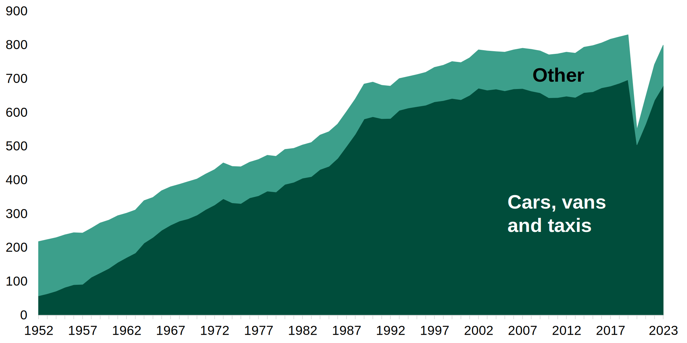
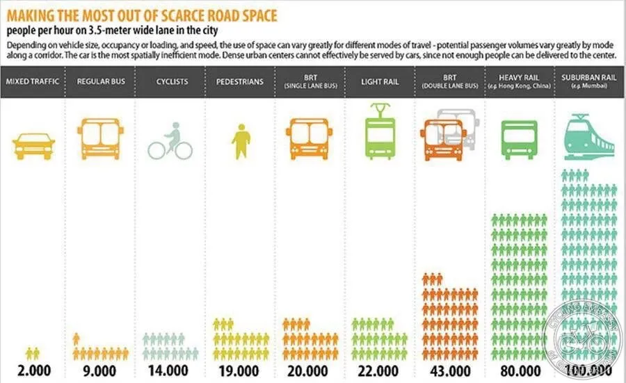

## Setting the scene

According to the [latest government statics](https://www.gov.uk/government/statistics/transport-statistics-great-britain-2024/transport-statistics-great-britain-2023-domestic-travel#:~:text=TSGB0101%20and%20TSGB0102.-,Of%20the,-799%20billion%20passenger), 90% of the distance travelled in Great Britain takes place by road: 85% by private vehicles, 4% by bus and cocach, and 1% by motorbikes and pedal bikes, while the remaining tenth is made up by rail (9%) and air (1%). This is a marked change from just a century ago, and this rise of car-centric transport and lifestyles has drastically changed out movement patterns and, as I'm going to argue, has largely done so for the worse.

*Passenger transport by car, vans and taxis compared to other modes (billion passenger kilometres): Great Britain, 1952 to 2023*

## Accessibility: Transport for *everyone*

Driving and owning a motor vehicle is a large responsibilty. Learning to drive is a time-consuming and expensive process, and something which is not an option for a lot of people. The young, the very old, the disabled, and many more are largely or not at all able to. Buying and maintaining a car is expensive: fuel, maintaince and MOTs, repairs, insurance, parking and road taxes nowadays combine to form British people's second largest expense after housing (food?).

I've titled this article "tranport should for the public" because I strongly believe that everyone has the right to get around and to where they need to, independently and without reliance on their ability and economic provisions to drive, or on a family member or friend to do so for them. I grew up in quite a car dependent place, and I was very reliant on my parents to take me around; if they're weren't available or willing to, I often couldn't (easliy, quickly or cheaply) get to where I wanted to.

Throughout most of our human history, we've walked everywhere. Or perhaps ridden a horse, maybe with a carriage. Sometimes even a boat if we were feeling adventerous. And these are still very good ways of getting around (bicycles now included as well), but in our modern societies we go much further distances, much more often. While active transport should remain our first option for shorter trips (for those who are able to), we need engine-powered vehicles to go further. And for transport to be truly accessible and universal we need solutions which are avaiable to everyone, low-cost, quick and conveninent.

## Cars: Unsustainable in more ways than one

I've laid out the moral case for public transport - for why it's needed, but it absolutely should not just be last option, for those don't have any others. It should be, with few exceptions, the first.

### Pollution

It's common knowledge that combustion engine cars are one of the most polluting forms of transport, heavily impacting both global warming and local levels of air pollution. And according to the latest UK Gov statistics, their greenhouse emissions per kilometre travelled are lower only than domestic flights, an option so unsustainable that countries such as France are taking steps to ban them<a id="n-1" href="#fn-1">1</a>.

It's true that hybrids and EVs are a lot better, but they're still not great options. The vast vast majority of cars are on the road have combustion-engines and will do for quite a long time. Even at the time of writing new EVs make up only [20% of new vehicle registrations](https://www.zap-map.com/ev-stats/ev-market), and 4% of cars on the road. But if you look closely at the chart you'll notice that EVs are actually not all that efficient. How can that be? In part because a lot of our electrcity production still comes from fossil fuels. But it's also because of the inherent inefficiency of lots of people owning and using cars. A lot of resources need to go into building and maintaing all these cars, and into the charging infrastructure to support them. And EVs use a lot more power per person than shared forms of transport because they have a very low carrying capacity. An average [car trip has 1.6 people](https://assets.publishing.service.gov.uk/media/66ce0f6f25c035a11941f655/nts0905.ods), but an average bus might have 10-20x as many, while only using 3-5x as much power, while having a much, much longer lifespan.

To really get the point across, national rail produces less emissions per km than EVs and the [majority of it](https://railmap.azurewebsites.net/Public/ElectrificationMap) is *not yet electrified*. The very high efficiency of train carriges combines with the low-friction of rail and with mostly uninterrupted journeys (no sudden breaking and acceleration, traffic or idling) makes them unbelievably efficient in terms of energy usage. The Eurostar - a fully electrified and modern train line - produces an order of magnitude less emissions than electric cars.

### Carrying capacity & infrastructure

While most people are familiar with the high levels of pollution caused by cars, their impact on space usage and knock-on effects on city designs is often less well understood. I've already alluded to their poor carrying capacity but to really put things into perspective it's helpful to see a visualisation.

Of all the common forms of transport, cars are the least efficient way of moving people. On the same sized track they carry 3-4x less people than cycling or walking and 8x less than dedicated bus lunes. Vs heavy rail and metros systems the comparison is even more stark with differences of 40-50x, notwithstanding that metros are often largely located underground and so can use next to no space.

So where does this matter? Most obiovulsy it matters in urban centres with high density housing and lots of people (commuters, tourists) moving in and out. Trying to transport hundreds of thousands or even millions of people by car in these locations would simply be impossible. Even more so because cars scale significantly worse than shared transport. City planners have long known about the concept of induced demand, where widening or building more roads generally leads to more people using the road and no improvements to traffic (or even degradations). With enough roads you *might* be able to overcome this problem, but the space and costs needed would be astronimical, as would the complexity of the system - and human drivers are not very good at using extra space and distributing themselves well. Public transport meanwhile is comparatively easy to scale as needed to meet the demands of even the most populated places on Earth.

## Car-first design and dependency

The effects of car-centric transport don't just affect urban centres, and it arguably has a greater impact on the rest of the population. Over the past hundred or so years many new places - mid and small sized towns - have been built to be car-first. While older settlements have been retrofitted to adapt, and metropolises simply can't support it, these places - above all in Northamerica and the countries most influenced by it - are desiged around cars. The end result of this is as inevitable as it is self-fufilling.

Pre-car towns and villages are designed around and for humans. Lots of amenities, attractions and places of work are located within a short walking of each other. Everything is built at a human scale - you can walk along the street and feel like you belong there, passing easily from building to building. When you needed to go between one walkable zone and another you'd take a form of collective transport such as a [tram/streetcar](https://en.wikipedia.org/wiki/Tram#History) or a horse and carridge. In stark contrast, places built around cars are often entierly unfriendly to humans. Buildings are spaced much further apart, often separated from 

https://www.britishparking.co.uk/write/documents/library/reports%20and%20research/bpa_uk_parking_sector_report_awweb.pdf

noise
transport capacity, road maintainance (infinite widening)
parking space - over 45m
safety, drivers (also, issues with self-driving)
dependency and city design, noise and places
price
rentals in america?

## Buses: stereotypes and reality

Of all the methods of transport, buses have possibly the worst reputation. While there was once a time when everyone would get the bus, ridership and service has been falling and falling, and nowadays in the UK they're often seen as only for the young, old, and poor, and this largely matches my experience of taking them. Especially outside of major cities such as London, few people take buses and 

## Rail: A return to the past?

Japan - orders or magnitude more train journeys, tickets for delays otherwise not a valid work/school excuse
75% of distance travelled by train??

## Pricing: Why free is better

## When private road vehicles do make sense

Many disabilities and those with poor mobility (though often having to be driven by others)
Off-road and remote locations or times (especially taxis, eg middle of the night)
Short-distance freight and deliveries
Large item transport - instruments/theatre, moving homes

TLDR: useful, but they should not be the default option

## A word on planes