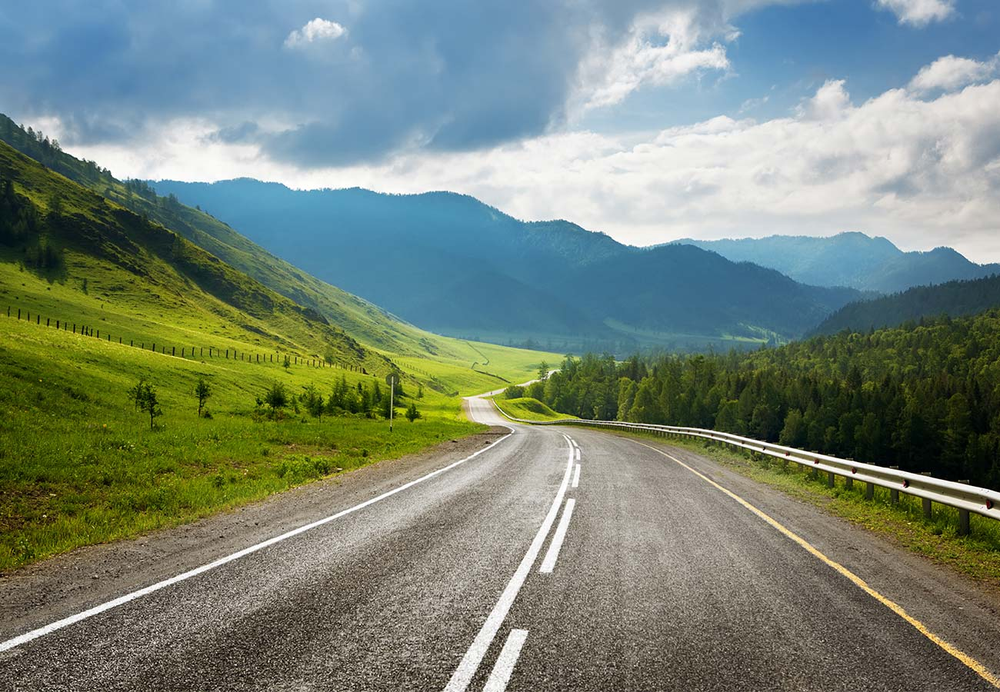
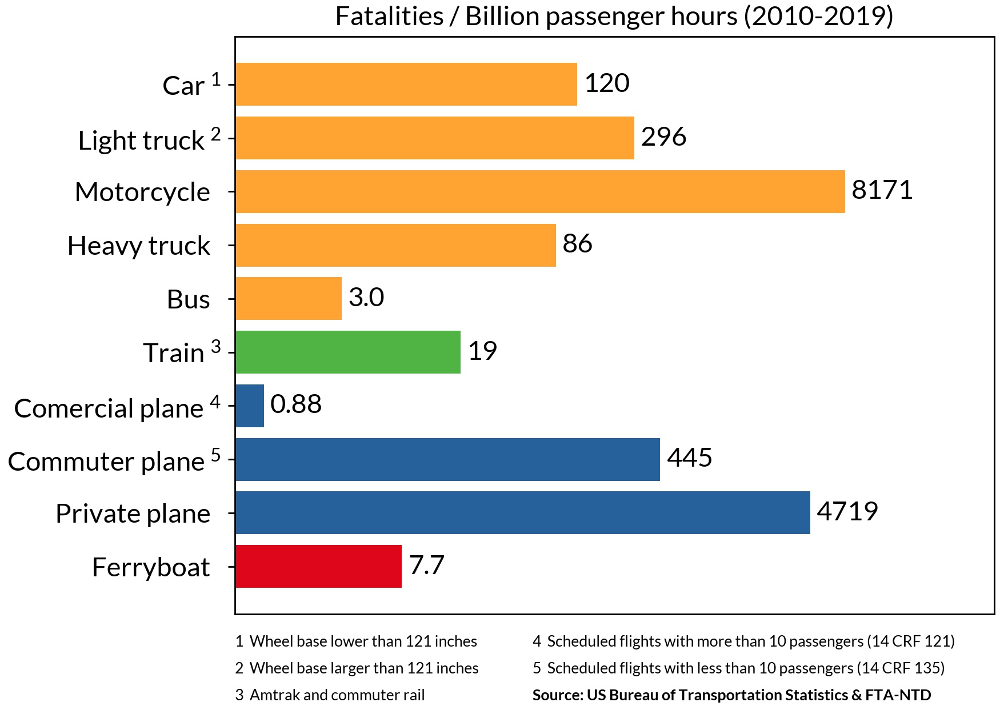

## The lay of the land

According to the [latest government statics](https://www.gov.uk/government/statistics/transport-statistics-great-britain-2024/transport-statistics-great-britain-2023-domestic-travel#:~:text=TSGB0101%20and%20TSGB0102.-,Of%20the,-799%20billion%20passenger), 90% of the distance travelled in Great Britain takes place by road: 85% by private vehicles, 4% by bus and cocach, and 1% by motorbikes and pedal bikes, while the remaining tenth is made up by rail (9%) and air (1%). This is a marked change from just a century ago, and this rise in car-centric transport and lifestyle has drastically changed out movement patterns and, as I'm going to argue, has largely done so for the worse.

Passenger transport by car, vans and taxis compared to other modes, billion passenger kilometres per year, Great Britain, 1952 to 2023

## Accessibility: Transport for *everyone*

Driving and owning a motor vehicle is a big responsibilty. Learning to drive is a time-consuming and expensive process, and something which is not an option for a lot of people. The young, the very old, the disabled, and many more are largely or not at all able to. Buying and maintaining a car is expensive: fuel, maintaince and MOTs, repairs, insurance, parking and road taxes nowadays combine to form British people's second largest expense after housing<a id="n-1" href="#fn-1">1</a>

<a href="https://www.ons.gov.uk/peoplepopulationandcommunity/personalandhouseholdfinances/expenditure/bulletins/familyspendingintheuk/april2022tomarch2023"><iframe name="weekly=expenditure" height="922px" width="100%" style="border:none;" src="https://www.ons.gov.uk/visualisations/dvc3011/treemap/index.html"></iframe></a>
Average weekly household expenditure in the UK, financial year ending (FYE) 2023, Office for National Statistics

I've titled this article "tranport should for the public" because I strongly believe that everyone has the right to get around and to where they need to, independently and without reliance on their ability and economic provisions to drive, or on a family member or friend to do so for them. I grew up in quite a car dependent place, and I was very reliant on my parents to take me around; if they're weren't available or willing to, I often couldn't (easliy, quickly or cheaply) get to where I wanted to.

Throughout most of our human history, we've walked everywhere. Or perhaps ridden a horse, maybe with a carriage. Sometimes even a boat if we were feeling adventerous. And these are still very good ways of getting around (bicycles now included as well), but in our modern societies we go much further distances, much more often. While active transport should remain our first option for shorter trips (for those who are able to), we need engine-powered vehicles to go further. And for transport to be truly accessible and universal we need solutions which are avaiable to everyone, low-cost, quick and conveninent.

## Cars: Unsustainable in more ways than one

I've laid out the moral case for public transport - for why it's needed, but it absolutely should not just be last option, for those don't have others. It should be, with few exceptions, the first.

### Pollution

It's common knowledge that combustion engine cars are one of the most polluting forms of transport, heavily impacting both global warming and local levels of air pollution, and noise pollution too. And according to the latest UK Gov statistics, their greenhouse emissions per kilometre are second only to domestic flights, an option so unsustainable that countries such as France are taking steps to ban them<a id="n-2" href="#fn-2">2</a>.

Carbon equivalent per kilometre of different modes of transport

It's true that hybrids and electric cars are a lot better, but they're still not great options. The vast vast majority of cars are on the road have combustion-engines and will do for quite a long time. Even at the time of writing new EVs make up only [20% of new vehicle registrations, and 4% of cars on the road](https://www.zap-map.com/ev-stats/ev-market). But if you look closely at the chart you'll notice that electric cars are actually not all that efficient. How can that be? In part because a lot of our electrcity production still comes from fossil fuels. But that's not the full picture, because options such as long-distance coaches which *do* mostly use fossil fuels are still more efficient, and local buses are significantly more efficent than petrol/diesel cars. The reason for this is that cars typically use a lot, lot more power per person. The average car trip has [1.6 people onboard](https://assets.publishing.service.gov.uk/media/66ce0f6f25c035a11941f655/nts0905.ods) and a maximum of 5, but an average bus trip has [11.9](https://assets.publishing.service.gov.uk/media/6745b86683f3d6d843be96c9/bus03.ods) and a maximum of 50-90<a id="n-3" href="#fn-3">3</a>, while only using 4-6x as much power.<a id="n-4" href="#fn-4">4</a>. If you do the maths this means that an average bus carries around 7.5x as many people, while using roughly 5x as much energy - an improvement of 1.5x. But if you take a reasonably full bus, say 80% capacity (56.25) vs the same for a car (4), you get 14x as many people - an improvement of almost 3x. With a car, you have a lot of car body for very few people, whereas a bus has a much higher ratio of people to vehicle, and will typical get far more use before having to be replaced.

To really get the point across, national rail, which typically does stop often, produces less emissions per km than EVs and the [majority of it](https://railmap.azurewebsites.net/Public/ElectrificationMap) is *not yet electrified*. The very high efficiency of train carriges (person to vehicle body ratio) combined with the low-friction of rail and with mostly smooth journeys (no sudden breaking and acceleration, traffic or idling) makes them unbelievably efficient in terms of energy usage. The Eurostar - a fully electrified and modern train line - produces an order of magnitude less emissions than electric cars.

### Carrying capacity & infrastructure

While most people are familiar with the high levels of pollution caused by cars, their impact on space usage and subsequent effects on city designs is often less well understood. I've already alluded to their poor carrying capacity but to really put things into perspective it's helpful to see a visualisation.

Maximum transport capacity (people) per hour on a 3.5 metre wide lane for different modes of transport

Of all the common forms of transport, cars are the least efficient way of moving people. On the same sized track they carry 3-4x less people than cycling or walking and 8x less than dedicated bus lunes. Vs heavy rail and metros systems the comparison is even more stark with differences of 40-50x, notwithstanding that metros are often largely located underground anyway.

So where does this matter? Most obviously it matters in urban centres with high density housing and lots of people (commuters, tourists) moving in and out. Trying to transport hundreds of thousands or even millions of people by car in these locations would simply be impossible. As well as being worse to begin with. trying to increase car carrying capacity tends to scale significantly worse than shared transport. City planners have well versed in the concept of induced demand, where widening or building more roads generally leads to more people using the road and no improvements to traffic (or even worsening). With enough roads you *might* be able to overcome this problem, but the space and costs needed would be astronimical, as would the complexity of the system - and human drivers are not very good at using extra road space and distributing themselves well on it. Public transport meanwhile is comparatively easy to scale as needed to meet the demands of even the most populated places on Earth.

### Car-first design & dependency

The effects of car-centric transport don't just affect urban centres, and they arguably have a greater impact on the rest of the population. Over the past hundred or so years many new places - mid and small sized towns - have been built to be car-first. While older settlements have been retrofitted to adapt, and metropolises simply can't support it, these places - above all in Northamerica and the countries with the most influence from there - are desiged around cars. The end result of this is as inevitable as it is self-fufilling.

Pre-car towns and villages are designed around and for humans. Lots of amenities, attractions and places of work are located within a short walking of each other. Everything is built at a human scale - you can walk along the street and feel like you belong there, passing easily from building to building. When you needed to go between one walkable zone and another you'd take a form of collective transport such as a [tram/streetcar](https://en.wikipedia.org/wiki/Tram#History) or a horse and carridge. In complete contrast, places built around cars are often entirely unfriendly to humans. Buildings are spaced much further apart, and often separated by busy roads and gigantic car parks.

Historically when designing and building a place, there's always been a clear distinction between roads and streets. *Roads* are designed for transporting pepole: for going between different zones within a city and between different cities or towns. They can be general-purpose roads intended for all sorts of vehicles such as horse drawn-ones, electric trolleycars, cycles and pedestrians, and of course cars, or dedicated train lines designed for heavy rail. As seen, rail tends to be more efficient, and faster, but less flexible. Both are important to have. But once you enter a town or a zone, you'd find mostly streets. *Streets* are designed for humans. They are typically a bit smaller, and filled with all sorts of shops, attractiones, parks, public spaces and facilities. While roads are usually fairly empty, save for an occasion service station, streets are the places where people live and spend time. Forums and plazas, markets, street musicians and performers, libraries and places of study, civil buildings, works of architecture and art: streets are what make a place.

Left: a road. Right: a street in Amsterdam

The problem with car-first designs is that they blur these lines. They design streets at the scale of a road, where everything is too far apart and very unfriendly, and usually dangerous, for humans. These street-road hybrids are often called *stroads*.

A stroad in the US

While it would theoretically be possible to walk to and around the above retail parks, they're clearly not designed for it. It would be incredibly dangerous to do so with the narrow or nonexistant pavements, placed near to and virutally without protection from the congested and chaotic lanes of traffic. To make a street an enjoyable place to be it both needs to be/feel safe, and to be inviting to its users: visually interesting and varied. This place and most like it are entirely barren, save for a sparce few repeating trees. I have walked around many of these and it's almost always a bad experience. It feels like you're completely out of place and that at any moment a car might appear out of nowhere and hit you (especially when there simply aren't pavements connecting certain parts), not to mentioned the noise and fumes. But when somewhere is designed for and at the scale of cars this is the result; anybody who's not inside a car is an outsider and the viscious cycle of car-design and car-dependency continues.

### Car-centric lifestyles & the parking problem

According to [research by the Briitsh Parking association](https://www.britishparking.co.uk/write/documents/library/reports%20and%20research/bpa_uk_parking_sector_report_awweb.pdf), there were estimated to be over 45 million parking spaces in 2013 (including private parking) - not far off 1 space per person. And [according to the RAC foundation](https://www.racfoundation.org/assets/rac_foundation/content/downloadables/facts_on_parking.pdf) the average car spends 96% of its time parked, and just 4% in use. These statistics helpfully highlight the final but equally important problem with car-centric design. We've looked at how car-first designs are very inefficient at moving people around, and so take up a lot of road (or stroad) space. We've talked about how they cause buildings to become oversized and placed very far apart, while making them highly unappealing to anyone not inside of a car. But the cherry on top is that in additional to all this, cars take up space when not in use - a lot of it. If you look at a top-down view of a retail park such as the above ones, or of a typical US surburb, you'll notice that most of the space that's not road is actually used for car parking. Street-level car parks take up vast quantities of space and often take this space away from streets and other human-scale buildings. A welcoming, enticing street or public space is broken by a large car park, and providing (or even mandating) multiple parking spaces per home is a sure-fire way to guarentee car-scale designs instead of human-scale ones.

It doesn't really need stating, but shared forms of transport use much less parking space. For one because there's a lot less needed due their efficiency and shared nature, but more acutely because when you get off a bus or train, or taxi, the vehicle continues on its way to serve other people, rarely stopping during the day. When stored at night they're typically parked out of the way in a station or depot. The difference with private vehicles could hardly be greater. Yet the above RAC foundation report states there there were over 27m private cars in 2012, close to 1 per every 2 people, while the [Department for Transport estimates](https://www.gov.uk/government/statistics/national-travel-survey-2022/national-travel-survey-2022-household-car-availability-and-trends-in-car-trips) that 78% of households have at least one car, with 34% having two or more.

With so many people owning cars, driving them around and parking them everywhere it becomes inevitable that many places end up being designed for cars and incorportating large car parks, large roads, and human-unfriendly designs.

## Safety

The final way in which cars can be considered unsustainable is in relation to safety. While we have let ourselves get acustomed to it, cars are dangerous. The US National Safety Council states that [1 in 7 preventable injury-related deaths comes from transport](https://injuryfacts.nsc.org/home-and-community/safety-topics/deaths-by-transportation-mode/), and the vast majority of these from car related incidents.

Looking at data from the US Bureau of Transportation Statics we can see that motorcycles, trucks and cars have the highest rate of occupant fatalities (private jets notwithstanding). But the picture is actually worse than it looks because a significant number of the fatalities caused by these vehicles are not the vehicle ocupants, but rather pedestrians and cyclists. In fact, walking and cycling are [statistically some of the least safe forms of transport](https://www.gov.uk/government/statistics/reported-road-casualties-great-britain-road-user-risk-2022/reported-road-casualties-great-britain-road-user-risk-2022-data), despite causing next to zero fatalities themselves.

Averaging by time instead of distance presents a similar picture, with trains and planes doing a bit worse due to generally going longer distances in less time, while buses and ferries improve.

It shouldn't really come as a surprise that private motor vehicles are so deadly given what they are: large, heavy chunks of metal going at high speeds in any direction that the drivers ends up taking them, often in spaces shared with or very close to pedestrians, cyclists, and other transport. Unlike train or plane journeys, road vehicles don't follow fixed routes and schedules in order to avoid contact with all other vehicles and people. Road vehicles are able to go anywhere, often weaving in any out of and overtaking each other, with drivers following new routes while doing their best to avoid all the other roads users and obstacles. On top of this, human drivers<a id="n-5" href="#fn-5">5</a> are generally bad drivers. They get tired, annoyed, drunk or sleep deprived (equally impairing), and sometimes even put some distorted perception of ego or pride/showing-off before the safety of others, not to mention speeding when they're late for something. Professional drivers, such as those found in buses and trains, are at least being employed to follow the rules of the road and treat their passengers and others with respect and safety, and generally do this a lot better than private vehicles owners.

While we do seem to have got used to it, we should expect better from our transport systems. It's hardly an uncommon sight to see a crashed car on the motorway or on smaller roads, and I personally have people in my family who've suffered debilitating injuries or even death from these accidents. If none of the previous arguments have resonated with you this should: the number of people we're killing and seriously injuring with our car-centric lifestyles is unacceptable, and needs to be solved. A shift away from such high car usage - especially in our streets and other pedestrian-heavy areas, is a must in order to acheive this.

price
rentals in america?

## Public transport: systems and advantages

Before talking about the different ways of running public transport, I'd like to quickly take a look at some of the positives of travelling like on it. So far I've been focused on the many drawbacks of car-first systems, but there's also a few ways aside from these in which shared transport can really shine.

I've talked about how driving a car is a large responsibility - and a dangerous one, and given the statistic of an average of 1.6 vehicle occupants, if you're in a car you're most likely driving it. But driving is a stressful and involved activity. It's true that after doing it a lot the mental load lightens a bit (although it's also the case that experienced drivers typically have some of the worst driving habits), but it's never something natural or easy like walking is. It's really quite bizarre that we've created a world in which a significant chunk of the population spend a lot of time doing it, and not as a job or a hobby. On public transport you don't need to worry about this. Instead of having one driver per every 1.6 people, you have one per every ten, thirty, or even hundreds, meaning that most people instead of focusing on driving can spend their time doing something else. I'm actually writing at this very moment from a train, and so far the entirety of this article has been written while on some from transport. I also like to read, listen to podcasts or watch things, or reply to messages and talk to friends. All things which you can't (at least not easily and safely) do while driving.

I've just said that driving is not a very natural activity, but I think this can be said for the whole experience of being in a car. Humans have evolved to travel under their own steam, as people, not to go around everywhere sat down inside a small metal box. Obviosuly we can't go everywhere by foot due to the long distances involved, but I think public transport is the closest to this ancestral past. When travelling on transport you normally have to, or at least have the option to, walk a bit. Walk to the station or stop, walk to get on and off and change transport, and to the final destination(s). I'm aware that not everyone is able to do or always wanting to do this, and I'll talk more about that in the next section, but I think for a lot of people a lot of the time this is actually quite a good thing. Spending a bit of time each day being active and building this activity into our usual transport is really good for us. It's a much healthier and more natural way of being than going from point A to B without moving at all and being nearly isolated from the world - instead we take part it in, in our communities, and alongside fellow human beings.

The final point I'd like to raise is that of going somewhere with other people. By car you might be able to go and pick everybody up, and then take them somewhere, and then drop them off again, but this is highly dependent on how far apart you live and how many people there are. While most cars will fit up to 4 or 5 people, more or less any other form of shared transport has a much larger capacity. This can make it a lot easier to meet up and go places, you simply get on at your nearest station or stop, and more often than not you can tell everyone to catch the same train or bus and then find each other on it. If someone's running late that's okay, they can get the next one and catch you up later, and the same is true if they want to leave earlier or later. It's more flexible for each individual person, and yet an easy option for larger groups. This works especially well if ticketing systems are easy to use, ideally being cheap and with unlimited travel like in the Community of Madrid, or entirely free like in Luxemburg. More on this in the pricing section of the article.

### Local transport

Undoubtedly the most well known form of local transport is the bus. And buses do some have quite important features. Unlike many heavier forms of transport, they're very flexible and easy to run. To set-up up a bus route you just need to get a bus running, and place some bus stops (they can be as simple as a sign). This means they're able to go almost anywhere, and quickly accomodate new developments and destinations into their routes. Buses are also typically very easy to get on and off, at least with local ones, it's usually a simple as getting on<a id="n-6" href="#fn-6">6</a> , without any need to pass through a station and find a platform. This, alongisde the fact that they usually have a lot of fairly close stops, can make them well-suited to less mobile folk who aren't able to walk so far.

That being said, local buses also have some quite serious drawbacks which makes them not suitable for a lot of uses cases, and which probably goes part of the way to explaining their falling ridership over the past few decades.

Less rigid than train systems. Much lower capacity and often less reliable (due to traffic)

Held back by car traffic (bus/taxi lanes)

Sometimes more comfortable than trains, sometimes less, depends on place

## Long distance 

Japan - orders of magnitude more train journeys, tickets for delays otherwise not a valid work/school excuse
75% of distance travelled by train??

Speed (in some places), with safety

Example of Gatwick or London more people arriving by train, space used?

## Pricing: Why the correct price is free

Collective action problem

Higher costs of auto-centric design patterns - lower financial productivty vs state-costs and area. See below

We've already mentioned the spatial inefficiency of cars, but as well as taking up much more road space and increasing the distance between places they also wear away roads faster due to their increased weight and speed. [Analysis from Urban3](https://www.urbanthree.com/services/cost-of-service-analysis/) shows that these sorts of designs are by and large financially insolvent, especially in the long-term, and have to be heavily subsidised by the traditional - often run-down and poorly funded - urban centres and older parts of the town.

## When private road vehicles do make sense

Many disabilities and those with poor mobility (though often having to be driven by others)
Off-road and remote locations or times (especially taxis, eg middle of the night)
Short-distance freight and deliveries
Large item transport - instruments/theatre, moving homes
Chartered coaches for specific trips (music)
Sometimes families, if children or pets that don't like public places

TLDR: useful, but they should not be the default option

## A word on planes

Bad boarding and lots of separate waiting, long walk through shops and queue for water and walk/wait for baggage pickup, rigidness of ticket and what you can take on board (sometimes arbitary/luck), all the add-ons to make more money (even booking a seat or fast boarding..) and difficulty of booking vs public transport (especially if you want the best price), normally located quite far outside of cities, generally only found near major cities, no connection and no using large technology for part of the trip

My experience France/Spain vs Edinburgh

TLDR: good for mid-long distance (bigger than UK), generally shouldn't be used for short

Motorbikes?