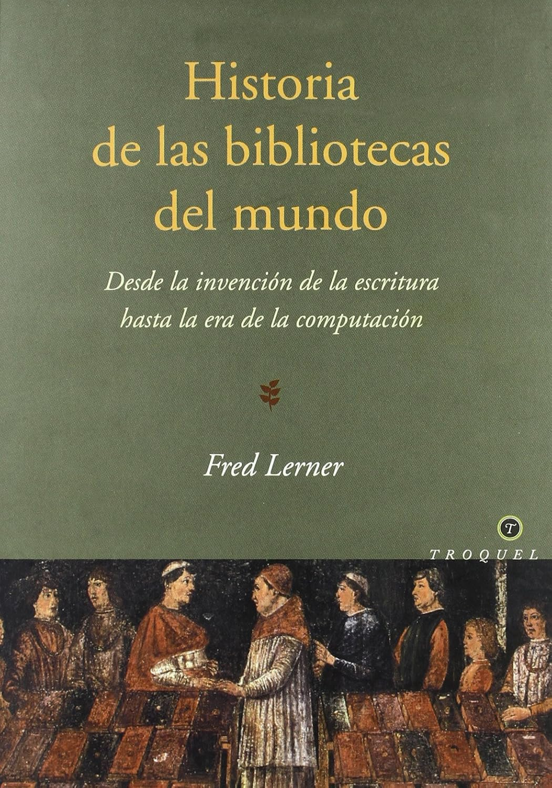
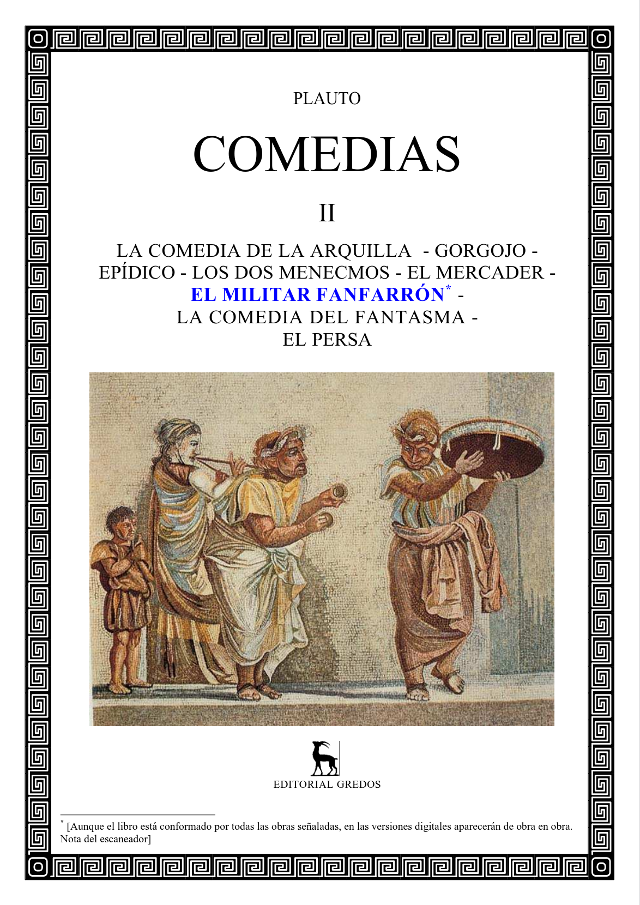
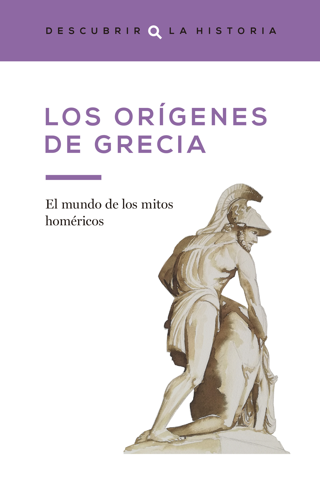
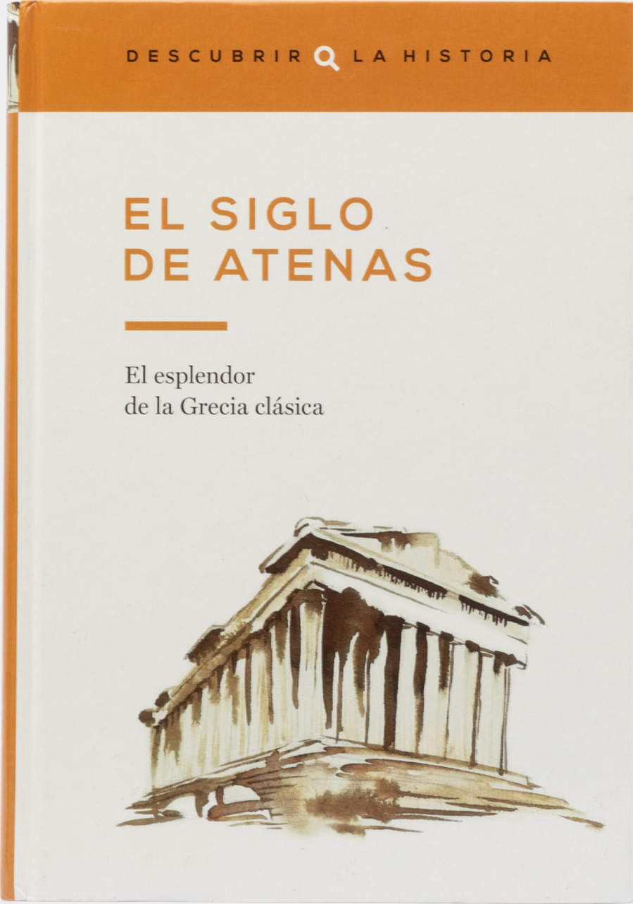
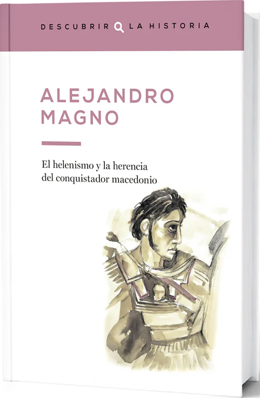
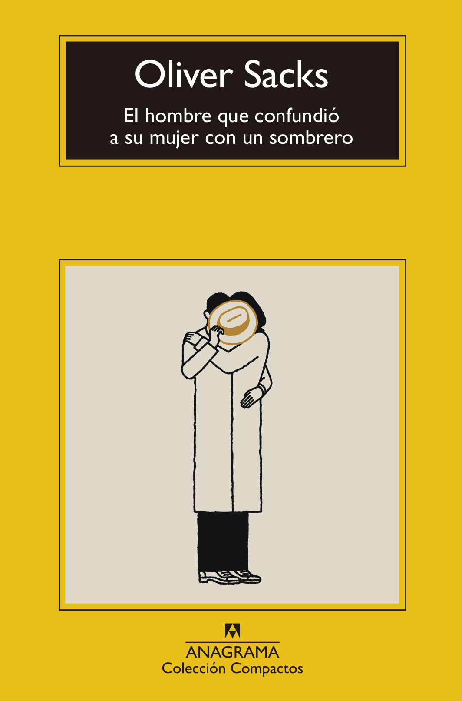

<!-- embedImage: "/blog/2025/reading-list-2025/embed image.avif" -->

<section>

</section>

<section>

## Historia de las bibliotecas del mundo - Fred Learner

</section>

<section>

## Miles Gloriosus - Plauto

</section>

<section>

## Viajes con Heródoto - Ryszard Kapuściński

</section>

<section>

## Los Orígenes de Grecia (Descubrir La Historia #2)

</section>

<section>

## El Siglo de Atenas (Descubrir La Historia #4)

</section>

<section>

## Alejandro Magno (Descubrir La Historia #5)

</section>

<section>

## El hombre que confudió a su mujer con un sombrero

</section>