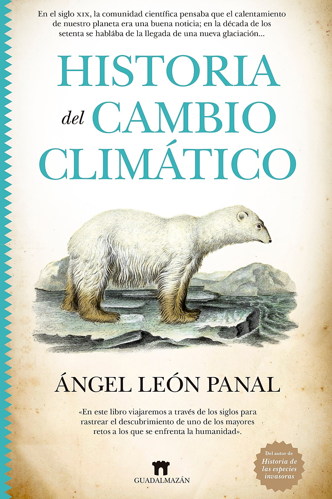
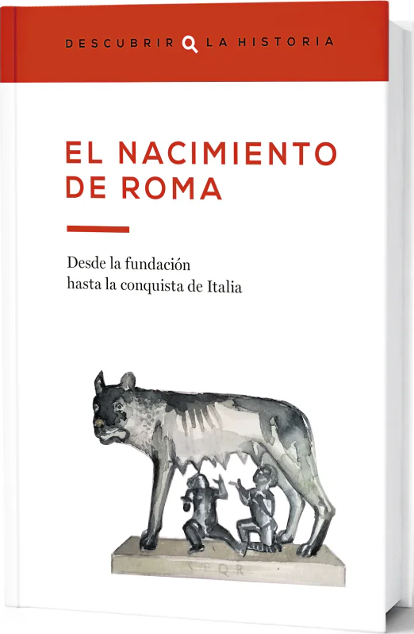

<!-- embedImage: "/blog/2025/reading-list-2025/embed image.avif" -->

<section>

</section>

<section>

## Historia de las bibliotecas del mundo - Fred Learner

Después de [La España de Altamira](http://localhost:8080/blog/2025/reading-list-2024/#:~:text=La%20Espa%C3%B1a%20de%20Altamira), este fue el primer libro en Español que leí por completo - y el primero que disfruté. A diferencia de ese, resultó mucho más fácil de leer, por tener menos vocabulario específico, y temas más familiares. Apropriadamente, lo encontré también en la biblioteca de la Universidad de Alcalá, y me gustó bastante. Aunque no uso tanto las bibliotecas tanto como antes, formaron una parte muy grande de las lecturas de mi infancia, y siempre tengo cariño hacia ellas. No sabía que tenían tanta importancia en la antiguedad, y fue divertido aprender de sus roles en diferentes civilizaciones.

El libro es un poco antiguo ahora (aunque creo que leí una edición más reciente), y las predicciones al final sobre internet y biblioteas digitales son curiosos - y algo optimistas, en comparación con la realidad. Lo acabé por comienzos del año, más o menos cuando empecé el curso de [Historia de la Lectura](https://www.uah.es/es/estudios/estudios-oficiales/grados/asignatura/Historia-de-la-Lectura-252013/), lo cuál era bastante útil.

</section>

<section>

## Miles Gloriosus - Plauto

</section>

<section>

## Viajes con Heródoto - Ryszard Kapuściński

</section>

<section>

## Los orígenes de Grecia (Descubrir la Historia #2)

</section>

<section>

## El siglo de Atenas (Descubrir la Historia #4)

</section>

<section>

## Alejandro Magno (Descubrir la Historia #5)

</section>

<section>

## El hombre que confudió a su mujer con un sombrero - Oliver Sacks

</section>

<section>

## El chico y el perro - Seishu Hase y Takashi Murakami

</section>

<section>

## El Antiguo Egipto (Descubrir la Historia #1)

</section>

<section>

## Historia del cambio climático - Ángel León Panal

</section>

<section>

## Historia del ferrocarril en España

</section>

<section>

## El nacimiento de Roma (Descubrir la Historia #3)

</section>