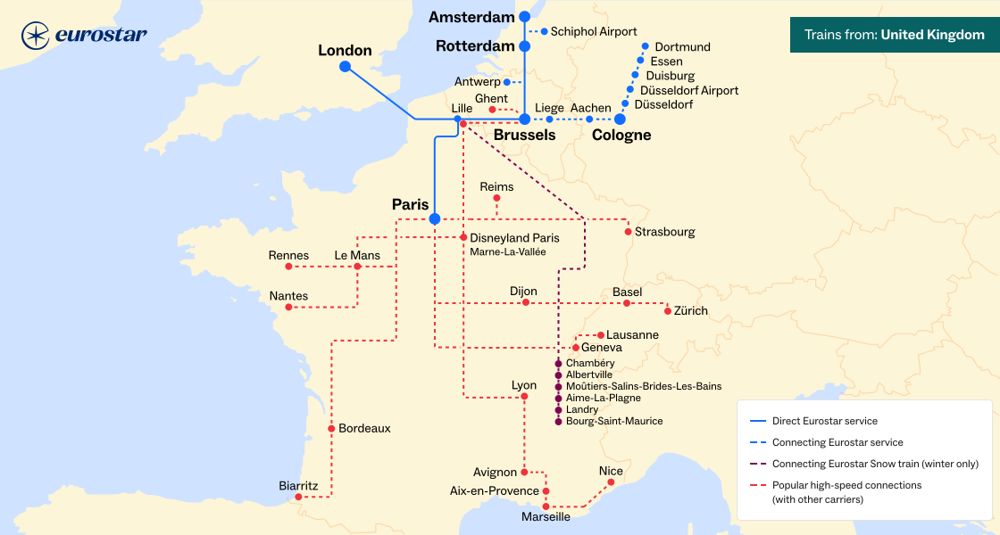

Over time I've come across more and more railway maps, and thought it'd be useful to list them here. I think this began when I started travelling by train more and I wanted to find out about the routes I was using, but it's really taken off since discovering [Loconundrum](https://loconundrum.aaronc.cc), and helping to found Exeter Uni's [Train Society](https://my.exeterguild.com/groups/8H8V6/train-society). Loads of maps and other information and tools get shared there, so it's been a great place to learn. Others come from friends, Mastodon, podcasts, and more places that I probably can't remember.

*Note: Northern Ireland's rail network is operated separately from the rest of the United Kingdom. Because of this, some of the maps on this list are for Great Britain (GB) only, which includes England, Wales and Scotland.*

%contents%

## Informational

### OpenStreetMap

[**OpenStreetMap**](https://www.openstreetmap.org/#layers=T) (OSM) has a good transport view. It's very much focused on infrastructure, showing different types of rail lines and stations, as well as metro systems and bus routes when you zoom in further. It's got coverage for more or less the whole world, and can be used straight from their website, or from a 3rd party app. Unfortunately there's no colour coding of lines, so it's not as great for metro systems, and heritage and disused or freight-only lines aren't clearly separated from national rail ones. I wish the transport layer worked at higher zoom levels as well, and that zooming was more granular. There's a great community of people creating and using OpenStreetMap projects though (as you'll see throughout this list!), and you can easily go and fix/update something yourself.

### Apple Maps

**Apple Maps** has a *really* good railway view - the best design I've come across, much to my annoyance. It's focused on passenger routes, shows main lines even when zoomed out to have the whole world in view, and shows branch lines and metros as you zoom in. Colour coding is great, clearly distinguishing heritage lines from national rail, and even showing who operates each line and station with decent accuracy. Non-passenger lines and bus routes are not shown, and some heritage ones are missing, which I think is reasonable. But being *Apple* Maps, it is primarily designed for wealthy Westerners. Coverage is quite limited outside of Western Europe and the US/Canada<a id="n-1" href="#fn-1">1</a>, and the transport view is only available on iOS/macOS. I'm hopeful that the [website](https://maps.apple.com) adds this at some point, but until then, and until more countries are covered, it's severely restricted in who it can be useful for.

### OpenRailwayMap

[**OpenRailwayMap**](https://www.openrailwaymap.org/?style=maxspeed) is a fantastic map showing max speeds, electrification, signalling, and more. The map style is easy to read, but super detailed, and I use this a lot for finding out information about different lines. It's based on <abbr title="OpenStreetMap" tabindex="-1">OSM</abbr>, and if it were a little faster, I would probably use it for everything train-related instead, but unfortunately it is a little slow and zooming can be quirky, so it's best used when on a stable connection and not on the move. The level of detail varies from country to country, but is constantly improving, and anyone is able to add to it.

### ElectrificationMap

Speaking of electrification, [**ElectrificationMap**](https://railmap.azurewebsites.net/Public/ElectrificationMap) is an interactive map showing the current state of <abbr title="Great Britain" tabindex="-1">GB</abbr> electrification, and the planned 2050 network. Predictably, it's also <abbr title="OpenStreetMap" tabindex="-1">OSM</abbr>-based, but provides info about ongoing and recent projects on the network. I don't use this a lot, but it's interesting to see what's going on and what's planned.

### National Rail Station and Accessibility Info

The [**National Rail Station and Accessibility Info**](https://railmap.nationalrail.co.uk/#/accessibility) is, aside from taking a surprising amount of time to load, a great resource for finding out about <abbr title="Great Britain" tabindex="-1">GB</abbr> station accessibility and other info. It shows colour-coded step-free categories on a map and specific details for each station, including facilities and opening hours, staff and passenger assistance, transport links, etc. There's also the [National Rail Interactive Route Map](https://railmap.nationalrail.co.uk/#/), which seems to be identical but is missing the colour coding and defaults to showing information about departures rather than station facilities.

## Routes

### World Train Map

[**World Train Map**](https://worldtrainmap.com) is a lovely <abbr title="OpenStreetMap" tabindex="-1">OSM</abbr>-based map showing a curated list of train journeys from around the world. The attention to detail is fantastic, I love the history and descriptions for each route, as well as being able to compare speed, passenger numbers and distance. The route map is beautiful and easy to understand, and the whole website is very surprisingly well made and pleasant to use. I could spend many hours looking through this and learning lots as I go. Helpfully there's also a button to show <abbr title="OpenStreetMap" tabindex="-1">OSM</abbr> routes which aren't included in the map.

### Chronotrains

[**Chronotrains**](https://www.chronotrains.com/en/explore/2643743-London) is a very fun <abbr title="OpenStreetMap" tabindex="-1">OSM</abbr>-based website for visualising how far you can get across Europe by train in a certain amount of time. You can choose any station or city and watch the area of the map increase as time goes up. Great for seeing how many different places you can go to and getting ideas for ones to visit. There's also the [route planner](https://www.chronotrains.com/en/station/2643743-London?maxTime=8), which shows an 8 hour heatmap and major destinations alongside the fastest route to get to them.

### Back on Track

[**Back on Track**](https://back-on-track.eu/night-train-map/) is a non-profit promoting sleeper trains (aka night trains) in Europe, who offer a very useful map for seeing all current routes and finding out when and where they run. Sleeper trains can be a great way of travelling longer distances sustainably and comfortably, and I'd love to try more of them in the future. The map is a bit slow, but very comprehensive, and it's great to increasingly see how many routes there are.

## Live

*Note: most live rail maps use estimates based on last known locations and average speed, so shouldn't be relied on when precise information is required.*

### Signalbox

[**Signalbox**](https://www.map.signalbox.io) is a very cool map showing all passenger trains on the <abbr title="Great Britain" tabindex="-1">GB</abbr> network moving in real time. Trains are colour-coded by how on time they're running, and you can click on any to see their route and stops. It's fascinating to see how many trains there are in your local area and across the whole country, and it's really easy to visualise the hotspots and busy lines. Yet again, built with <abbr title="OpenStreetMap" tabindex="-1">OSM</abbr> data.

### Renfe Tiempo Real

**Renfe Tiempo Real** is very similar, but for the Spanish rail network. Interestingly it's split up into [long-distance](https://tiempo-real.largorecorrido.renfe.com) and [short-distance](https://tiempo-real.renfe.com) versions, and colour coding is additionally used to denote train and track types. The map is generally a lot more detailed, but not as visually appealing - you can't see all trains when zoomed out which is no fun!

### Zone One

[**Zone One**](https://london.jamespotter.dev) is a really interesting map showing all transport in Central London: National Rail, Tube & DLR, buses, and even boats and planes. It makes use of <abbr title="OpenStreetMap" tabindex="-1">OSM</abbr>'s 3D buildings and renders both them and the different modes of transport in adorable and impressively accurate polygons. The movement animations can be a little wonky, but that kind of adds to the fun. It's an enchanting map, which is much faster than the other live ones listed here.

### One Day on Rails

[**One Day on Rails**](https://chillchamp1.github.io/github.io) is a fabulous map showing a timelapse of all train movements in a day, with a few different European countries, the US, and some metro systems to choose from. It's not live, but uses current data. Trains are coloured according to their type (high-speed, regional, sleeper trains, etc), and it's a great way of seeing which areas get more trains and which types, and how quickly/where they tend to go. It's also interesting seeing when the peaks are, and which services carry on overnight.

## Historical

### RailMapOnline

[**RailMapOnline**](https://www.railmaponline.com/UKIEMap.php) is a super useful resource showing all former UK & Ireland railways. It's eye-opening comparing this to a modern map and seeing all that no longer exists, but would often be very useful... It shows the old rail companies that ran each route, with nice distinct colours. It's interesting also seeing *which* areas have suffered more - the Isle of Wight for example lost all but one not particularly useful line, and most of North Cornwall/West Devon has been cut off from the network. There's [a few other maps](https://www.railmaponline.com/index.html) as well, including Trolleybus & Tramways and Western US.

### New Adlestrop Railway Atlas

The [**New Adlestrop Railway Atlas**](https://www.systemed.net/atlas/) is an excellent PDF map clearly showing Great Britain's current, former, freight-only, and heritage lines, and aims to cover [almost all passenger rail](https://www.systemed.net/atlas/#:~:text=The%20key%20is%3A-,Scope,-The%20map%20includes). Compared to RailMapOnline it's much easier to distinguish between these types, you can clearly see individual stations, and zooming is more granular. It's nice being able to download it as well, although the PDF can be slow to re-render the map when you zoom in/out, especially on older devices. Overall though they're both really good maps and complement each other well.

### OpenHistoricalMap

[**OpenHistoricalMap**](https://www.openhistoricalmap.org/) is OpenStreetMap with a time dimension. You can go from 1826 (and earlier!) to present day and watch the railways expand and contract. The map isn't complete, and this varies a lot between countries, but nonetheless is a useful tool. I especially like being able to set a speed and play a timeline. Aside from trains, it can also be used to see changes in countries and cities.

### National Library of Scotland's side by side viewer

The **National Library of Scotland's [historical maps](https://maps.nls.uk)** page is extensive, and of particular interest is the side by side viewer, which lets you compare any supported layer. For example, [OS Railways from 1946 vs OpenStreetMap](https://maps.nls.uk/geo/explore/side-by-side/#layers=10rail&right=osm). The historical maps are scans of old physical maps which is fun, and there's loads to choose from, though sadly just the one for railways.

## Miscellaneous

### Network Railcard Area

The [**Network Railcard Area**](https://www.network-railcard.co.uk/download/clientfiles/files/LSE%20July%202024.pdf) PDF map shows where a Network Railcard is valid. This has been frequently described as a two-tier system for London and the South vs the rest of the country. Much like a 16-25 or Senior Railcard, a Network Railcard will give you a third off most journeys. But only in this area - which is to say, one of the wealthiest parts of the UK. It's from the Network SouthEast era (1982-1994), when they used to operate there. Nowadays though it feels a bit forgotten about by National Rail. Why not cover the whole country, or have other regional equivalents? If it were up to me, I'd replace it with an "Adult Railcard" that works everywhere, but at a lower 20% discount.

### Eurostar routemap

The [**Eurostar routemap**](https://www.eurostar.com/uk-en/destinations/routemap) is useful for seeing where you can go internationally both direct or with one change. Hopefully the list of destinations will continue to grow, especially if Virgin Trains start operating through the tunnel in 2030 as promised, hopefully with some lower prices...

### HS2 phases

**[HS2 phases](https://en.wikipedia.org/wiki/High_Speed_2#/media/File:High_Speed_2_phases_map_2023.png)**, a handy map showing what was promised in 2012, and each subsequent reduction in scope. It's a depressing map, but one that's useful to have as a reference. I'm a semi-frequent user of Spain's high-speed rail network, which, despite covering a massive area of 3973 km, has so far reportedly [cost less](https://www.theguardian.com/commentisfree/2023/oct/11/spains-high-speed-trains-arent-just-efficient-they-have-transformed-peoples-lives#:~:text=The%20country%20has%20spent%20around%20%E2%82%AC57.2bn%20in%20building%20its%20network) than just the [reduced HS2 route](https://en.wikipedia.org/wiki/High_Speed_2#:~:text=HS2%20is%20expected%20to%20cost%20between) is expected to. Granted there's a lot of factors to this, and many costs are necessarily higher here - but the [>10x difference](https://mediarail.wordpress.com/how-spain-reaps-the-benefits-of-the-high-speed-railway-liberalisation/#:~:text=the%20average%20construction%20cost%20for%20high%2Dspeed%20railway%20lines%20in%20Spain) is stark.

### Freight corridors and commodities

Network Rail's [**Freight corridors and commodities**](https://www.networkrail.co.uk/wp-content/uploads/2023/04/Freight-map-Corridors-2023.pdf) map is an interesting PDF showing the main <abbr title="Great Britain" tabindex="-1">GB</abbr> freight lines and what's carried on them. There's a lot of overlap with the main passenger lines, but some differences, primarily around ports.

## Games

This category is about daily games (like Wordle) which either directly involve railway maps, or can be used alongside one.

[**Loconundrum**](https://loconundrum.aaronc.cc) is by far my most played. You guess National Rail stations and get told the quickest route, via public transport and walking. It's great fun, excellent for learning about the rail network and <abbr title="Great Britain" tabindex="-1">GB</abbr> geography, and it's recommended to be played alongside a map if you're not as confident or have got stuck.

[**Metrodle**](https://metrodle.com) is for the London Underground. There's a Tube map showing the immediate area around the station you're trying to guess, which only colours in the Underground lines once you've guessed stations on them. As you go you get told how many stops away you are from the target station, as well as if you've got any of the right lines. I find this harder than Loconundrum, but still quite fun.

[**DailyMetro**](https://dailymetro.live/) is an incredibly comprehensive game, containing 7 cities' metros with 14 more planned. There's 3 ways to play: classic, where you get information about the station (lines, direction you need to go in, zone, etc); map, where you can see the route to the target station from your guesses; and photo, where you get an image of the front of the station. I find it's harder to get started than Metrodle as you can't search for a line and see all the stations on it, but it is fun having the variety of places and ways to play.

[**Tubedoku**](https://tubedoku.com) is quite a difficult game where you have to fill in a Sudoku grid with 9 London train stations (tube or others) that fit certain characteristics, such as being on a specific line, a zone, or having certain letters. There's also versions for the New York Subway and the Chicago L.

[**Metro Memory**](https://metro-memory.com/madrid) is not a daily game, but more like a quiz where you guess the stations on the Madrid Metro. It's a fun way of doing it, with a nice map and animations, and a scoring system which tracks how well you're doing on each line.

[**Tubele**](https://tubele.app) is another, more recent game for guessing London stations. It's quite similar to DailyMetro, but gives you clues as you have more guesses. The design is pretty, but I don't think I enjoy playing it as much as DailyMetro or Metrodle.